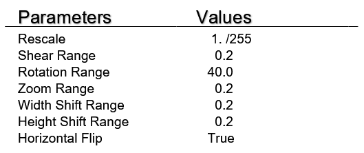
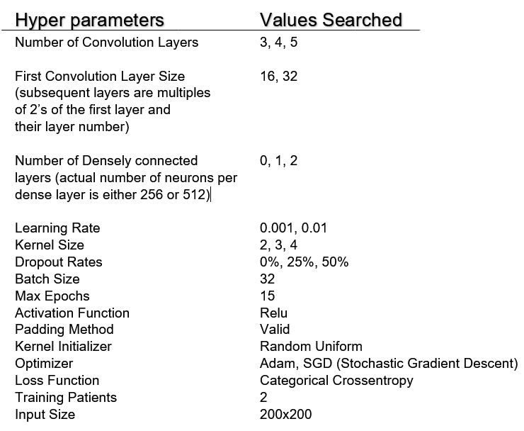
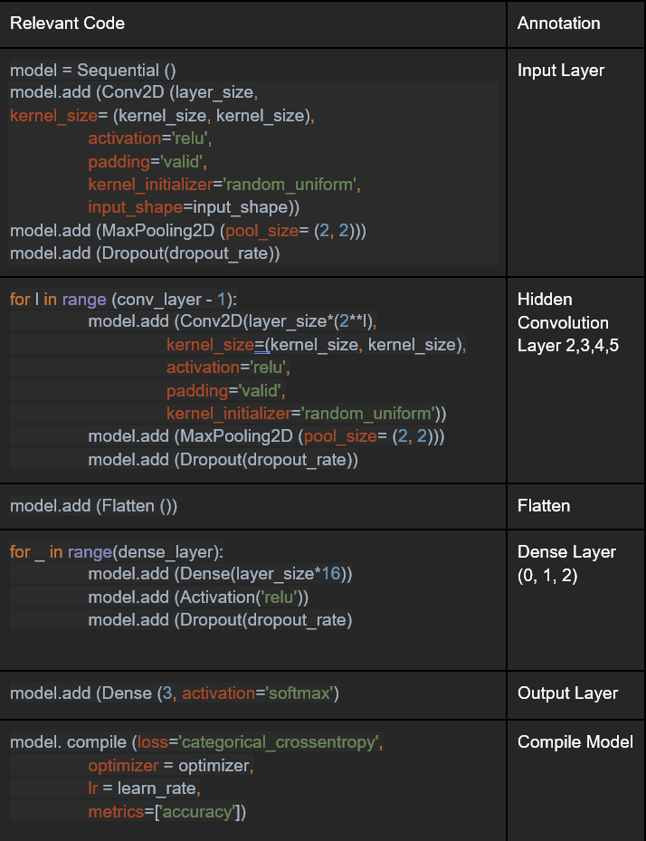

# MMAI-894-Team-Adelaide
Deep Learning Team Project

## Data Preparation
### Dataset Source
The [original data](https://data.mendeley.com/datasets/rscbjbr9sj/) is collected from Mendeley, Large Dataset of Labeled Optical Coherence Tomography (OCT) and Chest X-Ray Images.

This [raw data](RawData/) contains many datasets and we are using the 'NORMAL' and 'PNEUMONIA' sorted as 2 classes by the folder structure. 
```
RawData
│ 
└───NORMAL
│   │   personXXXX_normal_YYYY.JPEG
│   │   ...
│   
└───PNEUMONIA
    │   personXXXX_bactiria_YYYY.JPEG
    │   personXXXX_virus_YYYY.JPEG
    │   ...
```
### Creating  Classes Base on File Names
Within the 'PNEUMONIA' directory, the files are named as either 'personXXXX_bactiria_YYYY.JPEG' or 'personXXXX_virus_YYYY.JPEG'. We use the names to split the PNEUMONIA directory into 2 directory 'bacteria' and 'virus'. We also resized and images to 300x300 and center cropped the images with the script [CropMaxSquare.py](CropMaxSquare.py)
The script outputs a new directory named [center_crop_300](center_crop_300/)
```
center_crop_300
│ 
└───normal
│   │   personXXXX_normal_YYYY.JPEG
│   │   ...
│   
└───bacteria
|   │   personXXXX_virus_YYYY.JPEG
|   │   ...
│   
└───bacteria
    │   personXXXX_bactiria_YYYY.JPEG
    │   ...
```
### Data Cleanning
We noticed that a significant x-ray images consist man-made objects, such as medical equipments. To avoid potential data leakage, we mannually deleted. The remained data is saved in the directory named [center_crop_clean_300](center_crop_clean_300/)


### Final Data For ML Input
Once these preprocessing steps were completed, we proceeded with various experiment configurations of convolutional neural networks. The details of which will be discussed in the succeeding section.


## Experimnentation

### Train Test Split
Common to many proper Machine Learning process, the pre-processed images are splinted at ratio of 70% for training, 20% for validation, and 10% for test evaluation. This process is done by the script [Creat3Splits.py](Creat3Splits.py)

### ImageGenerator
To have more training images, we implemented image augmentation with the ImageDatagenerator from tensorflow.keras.preprocessing.image with the following parameters:


### ‘Grid Searching’ Best Models
As training a CNN can be computationally expensive, and grid search method of hyper parameter tuning is also very computationally expensive, with limited time in mind, the team have chosen the following commonly tuned hyper parameters:


### Dynamically Create Model
With all the tunable parameters, a total of 648 possible combinations of the CNN setup can be created and evaluated.
Each model was generated dynamically base on the current hyperparameter combination.


## Model Trainning
With Grid Searching and Dynamically Model Generation in mind we use script [model_withGridSearch.py](3_Classes/model_withGridSearch.py)

### Hardware Acceleration
Since we are testing many model candidates, the team decides to utilize GPU to accelerate the training process. In this case a Nvidia GTX1080 was used.
Windows enviroment is set up by following the [Guide](https://towardsdatascience.com/installing-tensorflow-with-cuda-cudnn-and-gpu-support-on-windows-10-60693e46e781) from towardsdatascience.com and the [instructions](https://www.pugetsystems.com/labs/hpc/The-Best-Way-to-Install-TensorFlow-with-GPU-Support-on-Windows-10-Without-Installing-CUDA-1187/) from pugetsystems.com and last, the Package [keras-gpu](https://anaconda.org/anaconda/keras-gpu) was installed to enable the use of GPU in the training process.


