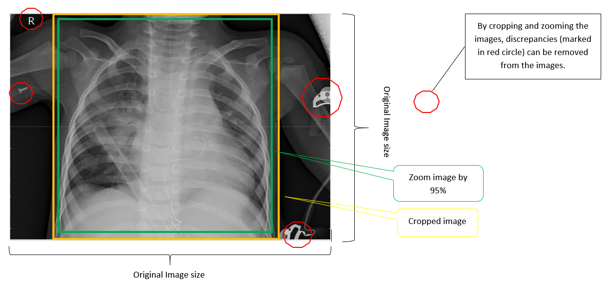
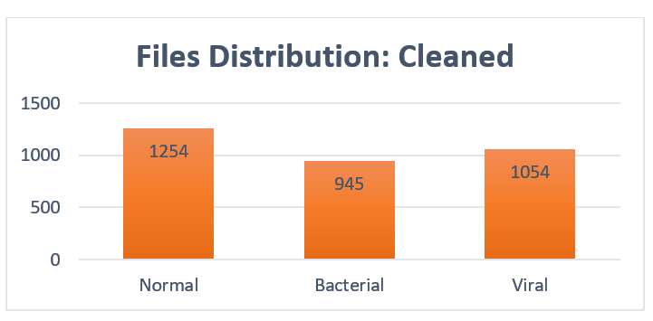
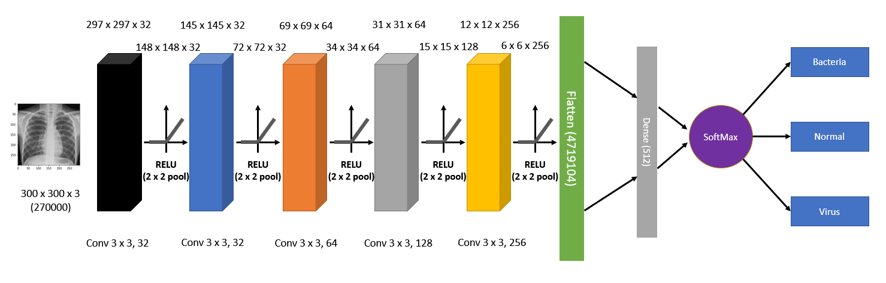
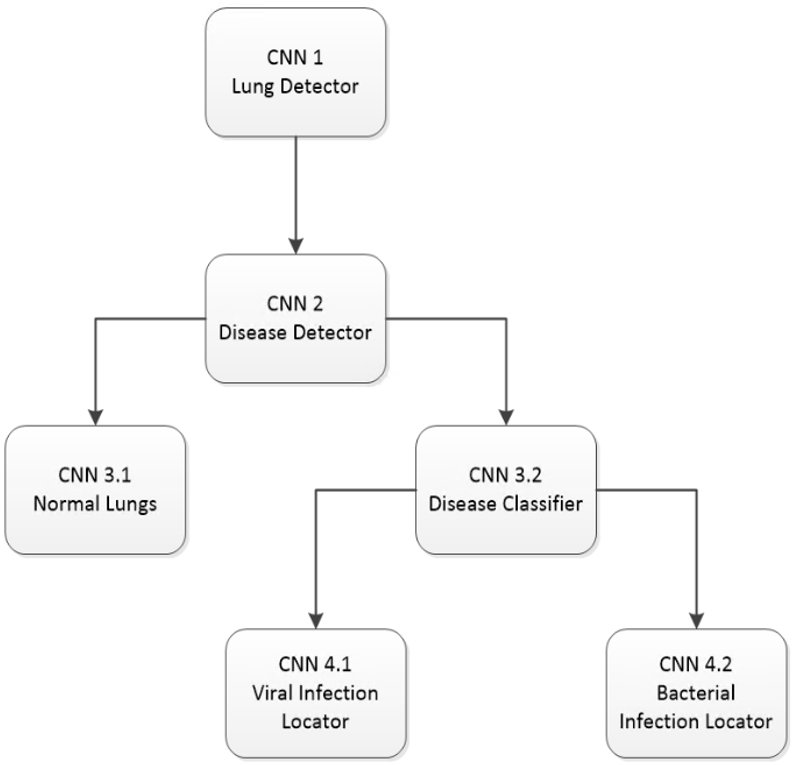

# MMAI-894-Team-Adelaide
Deep Learning Team Project
- [MMAI-894-Team-Adelaide](#mmai-894-team-adelaide)
  * [Introduction](#introduction)
    + [Objectives and Approach](#objectives-and-approach)
  * [Data Preparation](#data-preparation)
    + [Dataset Source](#dataset-source)
    + [Creating  Classes Base on File Names](#creating--classes-base-on-file-names)
    + [Data Cleanning](#data-cleanning)
    + [Final Data For ML Input](#final-data-for-ml-input)
    + [Train Test Split](#train-test-split)
  * [Experimnentation](#experimnentation)
    + [‘Grid Searching’ Best Models](#-grid-searching--best-models)
  * [Model Trainning](#model-trainning)
    + [Hardware Acceleration](#hardware-acceleration)
    + [Dynamically Create Model](#dynamically-create-model)
    + [ImageGenerators](#imagegenerators)
      - [.flow_from_directory](#flow-from-directory)
    + [Training Progress Monitoring and Model Saving](#training-progress-monitoring-and-model-saving)
      - [Tensorbaord Callback](#tensorbaord-callback)
      - [EarlyStop Callback](#earlystop-callback)
      - [CheckPoint Callback](#checkpoint-callback)
    + [.fit_generator](#fit-generator)
    + [Identify the Top Model](#identify-the-top-model)
  * [The Best Preforming Model](#the-best-preforming-model)
    + [Model Classification Report](#model-classification-report)
    + [Effect of Using Larger Input Size/Resolution](#effect-of-using-larger-input-size-resolution)
    + [Effect of Using Different Batch Size](#effect-of-using-different-batch-size)
    + [Effect of Learning Rate](#effect-of-learning-rate)
    + [Compare with Transfer Learning](#compare-with-transfer-learning)
  * [Future Scope](#future-scope)

<small><i><a href='http://ecotrust-canada.github.io/markdown-toc/'>Table of contents generated with markdown-toc</a></i></small>


## Introduction
According to the World Health Organization, pneumonia is the single most significant infectious cause of death in children worldwide. This disease is responsible for 15% of all deaths of children under the age of five, killing over 800,000 in 2017 or around 2,200 every day, mostly in South Asia and West and Central Africa. Children whose immune system may be weakened by malnutrition or undernourishment, especially in infants who are not exclusively breastfed. There are 1,400 cases of pneumonia per 100,000 children, or 1 per 71 children. 

This disease, however, does not occur exclusively in children alone. This disease can also affect adults as well. The number of children dying from pneumonia has decreased substantially over the past three decades. In 1990, more than two million children died from pneumonia every year: it was the leading cause of death in children, accounting for 20% of all childhood deaths. By 2017, this number had fallen by almost two-thirds.

### Objectives and Approach
There can be various contributors to the pneumonia mortality rate in children like malnutrition, air pollution, second-home smoke etc. However, this report focuses on the problem of differentiating a healthy lung from pneumonia-positive (bacteria and virus infected) via X-ray images. Our initial objective of this report was to come up with a CNN model to classify the X-ray images of the lung between normal vs pneumonia. However, according to the new study, the researchers found that patients diagnosed with bacterial pneumonia had a higher risk of heart attack, stroke or death, compared with patients diagnosed with viral pneumonia. Therefore, we have extended our model from two classifiers to three classifiers: 1) normal vs 2) pneumonia-bacteria and 3) pneumonia-viral. 

## Data Preparation
### Dataset Source
The [original data](https://data.mendeley.com/datasets/rscbjbr9sj/) is collected from Mendeley, Large Dataset of Labeled Optical Coherence Tomography (OCT) and Chest X-Ray Images.

This [raw data](RawData/) contains many datasets and we are using the 'NORMAL' and 'PNEUMONIA' sorted as 2 classes by the folder structure. 
```
RawData
│ 
└───NORMAL
│   │   personXXXX_normal_YYYY.JPEG
│   │   ...
│   
└───PNEUMONIA
    │   personXXXX_bactiria_YYYY.JPEG
    │   personXXXX_virus_YYYY.JPEG
    │   ...
```
### Creating  Classes Base on File Names
Within the 'PNEUMONIA' directory, the files are named as either 'personXXXX_bactiria_YYYY.JPEG' or 'personXXXX_virus_YYYY.JPEG'. We use the names to split the PNEUMONIA directory into 2 directory 'bacteria' and 'virus'. We also resized and images to 300x300 and center cropped the images with the script [CropMaxSquare.py](CropMaxSquare.py)
The script outputs a new directory named [center_crop_300](center_crop_300/)
```
center_crop_300
│ 
└───normal
│   │   personXXXX_normal_YYYY.JPEG
│   │   ...
│   
└───bacteria
|   │   personXXXX_virus_YYYY.JPEG
|   │   ...
│   
└───bacteria
    │   personXXXX_bactiria_YYYY.JPEG
    │   ...
```
### Data Cleanning
We noticed that a significant x-ray images consist man-made objects, such as medical equipments. To avoid potential data leakage, we mannually deleted. The remained data is saved in the directory named [center_crop_clean_300](center_crop_clean_300/)


### Final Data For ML Input
Once these preprocessing steps were completed, we proceeded with various experiment configurations of convolutional neural networks. The details of which will be discussed in the succeeding section.


### Train Test Split
Common to many proper Machine Learning process, the pre-processed images are splinted at ratio of 70% for training, 20% for validation, and 10% for test evaluation. This process is done by the script [Creat3Splits.py](Creat3Splits.py)

## Experimnentation
### ‘Grid Searching’ Best Models
As training a CNN can be computationally expensive, and grid search method of hyper parameter tuning is also very computationally expensive, with limited time in mind, the team have chosen the following commonly tuned hyper parameters:
<table style="border-collapse:collapse;border-spacing:0;border-color:#ccc;table-layout: fixed; width: 710px" class="tg"><colgroup><col style="width: 431px"><col style="width: 279px"></colgroup><tr><th style="font-family:Arial, sans-serif;font-size:14px;font-weight:normal;padding:10px 5px;border-style:solid;border-width:1px;overflow:hidden;word-break:normal;border-color:#ccc;color:#333;background-color:#f0f0f0;text-align:right;vertical-align:top">Hyper parameters</th><th style="font-family:Arial, sans-serif;font-size:14px;font-weight:normal;padding:10px 5px;border-style:solid;border-width:1px;overflow:hidden;word-break:normal;border-color:#ccc;color:#333;background-color:#f0f0f0;text-align:left;vertical-align:top">Values Searched</th></tr><tr><td style="font-family:Arial, sans-serif;font-size:14px;padding:10px 5px;border-style:solid;border-width:1px;overflow:hidden;word-break:normal;border-color:#ccc;color:#333;background-color:#f9f9f9;text-align:right;vertical-align:top">Number of Convolution Layers</td><td style="font-family:Arial, sans-serif;font-size:14px;padding:10px 5px;border-style:solid;border-width:1px;overflow:hidden;word-break:normal;border-color:#ccc;color:#333;background-color:#f9f9f9;text-align:left;vertical-align:top">3, 4, 5</td></tr><tr><td style="font-family:Arial, sans-serif;font-size:14px;padding:10px 5px;border-style:solid;border-width:1px;overflow:hidden;word-break:normal;border-color:#ccc;color:#333;background-color:#fff;text-align:right;vertical-align:top">First Convolution Layer Size (subsequent layers are multiples of 2’s of the first layer and their layer number-1)</td><td style="font-family:Arial, sans-serif;font-size:14px;padding:10px 5px;border-style:solid;border-width:1px;overflow:hidden;word-break:normal;border-color:#ccc;color:#333;background-color:#fff;text-align:left;vertical-align:top"><br>16, 32</td></tr><tr><td style="font-family:Arial, sans-serif;font-size:14px;padding:10px 5px;border-style:solid;border-width:1px;overflow:hidden;word-break:normal;border-color:#ccc;color:#333;background-color:#f9f9f9;text-align:right;vertical-align:top">Number of Densely connected layers (actual number of neurons per dense layer is either 256 or 512 )</td><td style="font-family:Arial, sans-serif;font-size:14px;padding:10px 5px;border-style:solid;border-width:1px;overflow:hidden;word-break:normal;border-color:#ccc;color:#333;background-color:#f9f9f9;text-align:left;vertical-align:top">0, 1, 2</td></tr><tr><td style="font-family:Arial, sans-serif;font-size:14px;padding:10px 5px;border-style:solid;border-width:1px;overflow:hidden;word-break:normal;border-color:#ccc;color:#333;background-color:#fff;text-align:right;vertical-align:top">Learning Rate</td><td style="font-family:Arial, sans-serif;font-size:14px;padding:10px 5px;border-style:solid;border-width:1px;overflow:hidden;word-break:normal;border-color:#ccc;color:#333;background-color:#fff;text-align:left;vertical-align:top">0.001, 0.01</td></tr><tr><td style="font-family:Arial, sans-serif;font-size:14px;padding:10px 5px;border-style:solid;border-width:1px;overflow:hidden;word-break:normal;border-color:#ccc;color:#333;background-color:#f9f9f9;text-align:right;vertical-align:top">Kernel Size</td><td style="font-family:Arial, sans-serif;font-size:14px;padding:10px 5px;border-style:solid;border-width:1px;overflow:hidden;word-break:normal;border-color:#ccc;color:#333;background-color:#f9f9f9;text-align:left;vertical-align:top">2, 3, 4</td></tr><tr><td style="font-family:Arial, sans-serif;font-size:14px;padding:10px 5px;border-style:solid;border-width:1px;overflow:hidden;word-break:normal;border-color:#ccc;color:#333;background-color:#fff;text-align:right;vertical-align:top">Dropout Rates</td><td style="font-family:Arial, sans-serif;font-size:14px;padding:10px 5px;border-style:solid;border-width:1px;overflow:hidden;word-break:normal;border-color:#ccc;color:#333;background-color:#fff;text-align:left;vertical-align:top">0%, 25%, 50%</td></tr><tr><td style="font-family:Arial, sans-serif;font-size:14px;padding:10px 5px;border-style:solid;border-width:1px;overflow:hidden;word-break:normal;border-color:#ccc;color:#333;background-color:#f9f9f9;text-align:right;vertical-align:top">Batch Size</td><td style="font-family:Arial, sans-serif;font-size:14px;padding:10px 5px;border-style:solid;border-width:1px;overflow:hidden;word-break:normal;border-color:#ccc;color:#333;background-color:#f9f9f9;text-align:left;vertical-align:top">32</td></tr><tr><td style="font-family:Arial, sans-serif;font-size:14px;padding:10px 5px;border-style:solid;border-width:1px;overflow:hidden;word-break:normal;border-color:#ccc;color:#333;background-color:#fff;text-align:right;vertical-align:top">Max Epochs</td><td style="font-family:Arial, sans-serif;font-size:14px;padding:10px 5px;border-style:solid;border-width:1px;overflow:hidden;word-break:normal;border-color:#ccc;color:#333;background-color:#fff;text-align:left;vertical-align:top">15</td></tr><tr><td style="font-family:Arial, sans-serif;font-size:14px;padding:10px 5px;border-style:solid;border-width:1px;overflow:hidden;word-break:normal;border-color:#ccc;color:#333;background-color:#f9f9f9;text-align:right;vertical-align:top">Activation Function</td><td style="font-family:Arial, sans-serif;font-size:14px;padding:10px 5px;border-style:solid;border-width:1px;overflow:hidden;word-break:normal;border-color:#ccc;color:#333;background-color:#f9f9f9;text-align:left;vertical-align:top">Relu</td></tr><tr><td style="font-family:Arial, sans-serif;font-size:14px;padding:10px 5px;border-style:solid;border-width:1px;overflow:hidden;word-break:normal;border-color:#ccc;color:#333;background-color:#fff;text-align:right;vertical-align:top">Padding Method</td><td style="font-family:Arial, sans-serif;font-size:14px;padding:10px 5px;border-style:solid;border-width:1px;overflow:hidden;word-break:normal;border-color:#ccc;color:#333;background-color:#fff;text-align:left;vertical-align:top">Valid</td></tr><tr><td style="font-family:Arial, sans-serif;font-size:14px;padding:10px 5px;border-style:solid;border-width:1px;overflow:hidden;word-break:normal;border-color:#ccc;color:#333;background-color:#f9f9f9;text-align:right;vertical-align:top">Kernel Initializer</td><td style="font-family:Arial, sans-serif;font-size:14px;padding:10px 5px;border-style:solid;border-width:1px;overflow:hidden;word-break:normal;border-color:#ccc;color:#333;background-color:#f9f9f9;text-align:left;vertical-align:top">Random Uniform</td></tr><tr><td style="font-family:Arial, sans-serif;font-size:14px;padding:10px 5px;border-style:solid;border-width:1px;overflow:hidden;word-break:normal;border-color:#ccc;color:#333;background-color:#fff;text-align:right;vertical-align:top">Optimizer</td><td style="font-family:Arial, sans-serif;font-size:14px;padding:10px 5px;border-style:solid;border-width:1px;overflow:hidden;word-break:normal;border-color:#ccc;color:#333;background-color:#fff;text-align:left;vertical-align:top">Adam, SGD (Stochastic Gradient Descent)</td></tr><tr><td style="font-family:Arial, sans-serif;font-size:14px;padding:10px 5px;border-style:solid;border-width:1px;overflow:hidden;word-break:normal;border-color:#ccc;color:#333;background-color:#f9f9f9;text-align:right;vertical-align:top">Loss Function</td><td style="font-family:Arial, sans-serif;font-size:14px;padding:10px 5px;border-style:solid;border-width:1px;overflow:hidden;word-break:normal;border-color:#ccc;color:#333;background-color:#f9f9f9;text-align:left;vertical-align:top">Categorical Crossentropy</td></tr><tr><td style="font-family:Arial, sans-serif;font-size:14px;padding:10px 5px;border-style:solid;border-width:1px;overflow:hidden;word-break:normal;border-color:#ccc;color:#333;background-color:#fff;text-align:right;vertical-align:top">Training Patients</td><td style="font-family:Arial, sans-serif;font-size:14px;padding:10px 5px;border-style:solid;border-width:1px;overflow:hidden;word-break:normal;border-color:#ccc;color:#333;background-color:#fff;text-align:left;vertical-align:top">2</td></tr><tr><td style="font-family:Arial, sans-serif;font-size:14px;padding:10px 5px;border-style:solid;border-width:1px;overflow:hidden;word-break:normal;border-color:#ccc;color:#333;background-color:#f9f9f9;text-align:right;vertical-align:top">Input Size</td><td style="font-family:Arial, sans-serif;font-size:14px;padding:10px 5px;border-style:solid;border-width:1px;overflow:hidden;word-break:normal;border-color:#ccc;color:#333;background-color:#f9f9f9;text-align:left;vertical-align:top">200x200x3</td></tr></table>

## Model Trainning
With Grid Searching and Dynamically Model Generation in mind we use script [model_withGridSearch.py](3_Classes/model_withGridSearch.py)

### Hardware Acceleration
Since we are testing many model candidates, the team decides to utilize GPU to accelerate the training process. In this case a Nvidia GTX1080 was used.
Windows enviroment is set up by following the [Guide](https://towardsdatascience.com/installing-tensorflow-with-cuda-cudnn-and-gpu-support-on-windows-10-60693e46e781) from towardsdatascience.com and the [instructions](https://www.pugetsystems.com/labs/hpc/The-Best-Way-to-Install-TensorFlow-with-GPU-Support-on-Windows-10-Without-Installing-CUDA-1187/) from pugetsystems.com and last, the Package [keras-gpu](https://anaconda.org/anaconda/keras-gpu) was installed to enable the use of GPU in the training process.

### Dynamically Create Model
With all the tunable parameters, a total of 648 possible combinations of the CNN setup can be created and evaluated.
Each model was generated dynamically base on the current hyperparameter combination.

<table>
<tr>
  <th>Relavent Code</th>
  <th>Annotations</th>
</tr>
<tr>
<td>
    
  ```python
  model = Sequential()
```
</td>
<td>Initialize Model<br></td></tr>
<tr>
<td>

  ```python
model.add(Conv2D(layer_size,
        kernel_size=(kernel_size, kernel_size),
        activation='relu',
        padding='valid',
        kernel_initializer='random_uniform',
        input_shape=input_shape))
model.add(MaxPooling2D(pool_size=(2, 2)))
model.add(Dropout(dropout_rate))
```
</td>
<td>Input Layer</td></tr>
<tr>
<td>

  ```python
for l in range(conv_layer - 1):
model.add(Conv2D(layer_size*(2**l),
                 kernel_size=(kernel_size, kernel_size),
                 activation='relu',
                 padding='valid',
                 kernel_initializer='random_uniform'))
model.add(MaxPooling2D(pool_size=(2, 2)))
model.add(Dropout(dropout_rate))
```
</td>
<td>Hidden Convolution Layers 2,3,4,5<br></td></tr>
<tr>
<td>

  ```python
model.add(Flatten())
```
</td>
<td>Flatten</td></tr>
<tr>
<td>

  ```python
for _ in range(dense_layer):
    model.add(Dense(layer_size*16))
    model.add(Activation('relu'))
    model.add(Dropout(dropout_rate))
```
</td>
<td>Dense Layer none,1,2</td></tr>
<tr>
<td>

  ```python
model.add(Dense(3, activation='softmax'))
```
</td>
<td>Output Layer</td></tr>
<tr>
<td>

  ```python
model.compile(loss='categorical_crossentropy',
                optimizer = optimizer,
                lr = learn_rate,
                metrics=['accuracy'])
``` 
</td>
<td>Compile Model</td></tr>
</table>

### ImageGenerators
To have more training images, we implemented image augmentation with the ImageDatagenerator from tensorflow.keras.preprocessing.image with the following parameters:
<table style="border-collapse:collapse;border-spacing:0;border-color:#ccc;table-layout: fixed; width: 710px" class="tg"><colgroup><col style="width: 431px"><col style="width: 279px"></colgroup><tr><th style="font-family:Arial, sans-serif;font-size:14px;font-weight:normal;padding:10px 5px;border-style:solid;border-width:1px;overflow:hidden;word-break:normal;border-color:#ccc;color:#333;background-color:#f0f0f0;text-align:right;vertical-align:top">Hyper parameters</th><th style="font-family:Arial, sans-serif;font-size:14px;font-weight:normal;padding:10px 5px;border-style:solid;border-width:1px;overflow:hidden;word-break:normal;border-color:#ccc;color:#333;background-color:#f0f0f0;text-align:left;vertical-align:top">Values Searched</th></tr><tr><td style="font-family:Arial, sans-serif;font-size:14px;padding:10px 5px;border-style:solid;border-width:1px;overflow:hidden;word-break:normal;border-color:#ccc;color:#333;background-color:#f9f9f9;text-align:right;vertical-align:top">Number of Convolution Layers</td><td style="font-family:Arial, sans-serif;font-size:14px;padding:10px 5px;border-style:solid;border-width:1px;overflow:hidden;word-break:normal;border-color:#ccc;color:#333;background-color:#f9f9f9;text-align:left;vertical-align:top">3, 4, 5</td></tr><tr><td style="font-family:Arial, sans-serif;font-size:14px;padding:10px 5px;border-style:solid;border-width:1px;overflow:hidden;word-break:normal;border-color:#ccc;color:#333;background-color:#fff;text-align:right;vertical-align:top">First Convolution Layer Size (subsequent layers are multiples of 2’s of the first layer and their layer number-1)</td><td style="font-family:Arial, sans-serif;font-size:14px;padding:10px 5px;border-style:solid;border-width:1px;overflow:hidden;word-break:normal;border-color:#ccc;color:#333;background-color:#fff;text-align:left;vertical-align:top"><br>16, 32</td></tr><tr><td style="font-family:Arial, sans-serif;font-size:14px;padding:10px 5px;border-style:solid;border-width:1px;overflow:hidden;word-break:normal;border-color:#ccc;color:#333;background-color:#f9f9f9;text-align:right;vertical-align:top">Number of Densely connected layers (actual number of neurons per dense layer is either 256 or 512 )</td><td style="font-family:Arial, sans-serif;font-size:14px;padding:10px 5px;border-style:solid;border-width:1px;overflow:hidden;word-break:normal;border-color:#ccc;color:#333;background-color:#f9f9f9;text-align:left;vertical-align:top">0, 1, 2</td></tr><tr><td style="font-family:Arial, sans-serif;font-size:14px;padding:10px 5px;border-style:solid;border-width:1px;overflow:hidden;word-break:normal;border-color:#ccc;color:#333;background-color:#fff;text-align:right;vertical-align:top">Learning Rate</td><td style="font-family:Arial, sans-serif;font-size:14px;padding:10px 5px;border-style:solid;border-width:1px;overflow:hidden;word-break:normal;border-color:#ccc;color:#333;background-color:#fff;text-align:left;vertical-align:top">0.001, 0.01</td></tr><tr><td style="font-family:Arial, sans-serif;font-size:14px;padding:10px 5px;border-style:solid;border-width:1px;overflow:hidden;word-break:normal;border-color:#ccc;color:#333;background-color:#f9f9f9;text-align:right;vertical-align:top">Kernel Size</td><td style="font-family:Arial, sans-serif;font-size:14px;padding:10px 5px;border-style:solid;border-width:1px;overflow:hidden;word-break:normal;border-color:#ccc;color:#333;background-color:#f9f9f9;text-align:left;vertical-align:top">2, 3, 4</td></tr><tr><td style="font-family:Arial, sans-serif;font-size:14px;padding:10px 5px;border-style:solid;border-width:1px;overflow:hidden;word-break:normal;border-color:#ccc;color:#333;background-color:#fff;text-align:right;vertical-align:top">Dropout Rates</td><td style="font-family:Arial, sans-serif;font-size:14px;padding:10px 5px;border-style:solid;border-width:1px;overflow:hidden;word-break:normal;border-color:#ccc;color:#333;background-color:#fff;text-align:left;vertical-align:top">0%, 25%, 50%</td></tr><tr><td style="font-family:Arial, sans-serif;font-size:14px;padding:10px 5px;border-style:solid;border-width:1px;overflow:hidden;word-break:normal;border-color:#ccc;color:#333;background-color:#f9f9f9;text-align:right;vertical-align:top">Batch Size</td><td style="font-family:Arial, sans-serif;font-size:14px;padding:10px 5px;border-style:solid;border-width:1px;overflow:hidden;word-break:normal;border-color:#ccc;color:#333;background-color:#f9f9f9;text-align:left;vertical-align:top">32</td></tr><tr><td style="font-family:Arial, sans-serif;font-size:14px;padding:10px 5px;border-style:solid;border-width:1px;overflow:hidden;word-break:normal;border-color:#ccc;color:#333;background-color:#fff;text-align:right;vertical-align:top">Max Epochs</td><td style="font-family:Arial, sans-serif;font-size:14px;padding:10px 5px;border-style:solid;border-width:1px;overflow:hidden;word-break:normal;border-color:#ccc;color:#333;background-color:#fff;text-align:left;vertical-align:top">15</td></tr><tr><td style="font-family:Arial, sans-serif;font-size:14px;padding:10px 5px;border-style:solid;border-width:1px;overflow:hidden;word-break:normal;border-color:#ccc;color:#333;background-color:#f9f9f9;text-align:right;vertical-align:top">Activation Function</td><td style="font-family:Arial, sans-serif;font-size:14px;padding:10px 5px;border-style:solid;border-width:1px;overflow:hidden;word-break:normal;border-color:#ccc;color:#333;background-color:#f9f9f9;text-align:left;vertical-align:top">Relu</td></tr><tr><td style="font-family:Arial, sans-serif;font-size:14px;padding:10px 5px;border-style:solid;border-width:1px;overflow:hidden;word-break:normal;border-color:#ccc;color:#333;background-color:#fff;text-align:right;vertical-align:top">Padding Method</td><td style="font-family:Arial, sans-serif;font-size:14px;padding:10px 5px;border-style:solid;border-width:1px;overflow:hidden;word-break:normal;border-color:#ccc;color:#333;background-color:#fff;text-align:left;vertical-align:top">Valid</td></tr><tr><td style="font-family:Arial, sans-serif;font-size:14px;padding:10px 5px;border-style:solid;border-width:1px;overflow:hidden;word-break:normal;border-color:#ccc;color:#333;background-color:#f9f9f9;text-align:right;vertical-align:top">Kernel Initializer</td><td style="font-family:Arial, sans-serif;font-size:14px;padding:10px 5px;border-style:solid;border-width:1px;overflow:hidden;word-break:normal;border-color:#ccc;color:#333;background-color:#f9f9f9;text-align:left;vertical-align:top">Random Uniform</td></tr><tr><td style="font-family:Arial, sans-serif;font-size:14px;padding:10px 5px;border-style:solid;border-width:1px;overflow:hidden;word-break:normal;border-color:#ccc;color:#333;background-color:#fff;text-align:right;vertical-align:top">Optimizer</td><td style="font-family:Arial, sans-serif;font-size:14px;padding:10px 5px;border-style:solid;border-width:1px;overflow:hidden;word-break:normal;border-color:#ccc;color:#333;background-color:#fff;text-align:left;vertical-align:top">Adam, SGD (Stochastic Gradient Descent)</td></tr><tr><td style="font-family:Arial, sans-serif;font-size:14px;padding:10px 5px;border-style:solid;border-width:1px;overflow:hidden;word-break:normal;border-color:#ccc;color:#333;background-color:#f9f9f9;text-align:right;vertical-align:top">Loss Function</td><td style="font-family:Arial, sans-serif;font-size:14px;padding:10px 5px;border-style:solid;border-width:1px;overflow:hidden;word-break:normal;border-color:#ccc;color:#333;background-color:#f9f9f9;text-align:left;vertical-align:top">Categorical Crossentropy</td></tr><tr><td style="font-family:Arial, sans-serif;font-size:14px;padding:10px 5px;border-style:solid;border-width:1px;overflow:hidden;word-break:normal;border-color:#ccc;color:#333;background-color:#fff;text-align:right;vertical-align:top">Training Patients</td><td style="font-family:Arial, sans-serif;font-size:14px;padding:10px 5px;border-style:solid;border-width:1px;overflow:hidden;word-break:normal;border-color:#ccc;color:#333;background-color:#fff;text-align:left;vertical-align:top">2</td></tr><tr><td style="font-family:Arial, sans-serif;font-size:14px;padding:10px 5px;border-style:solid;border-width:1px;overflow:hidden;word-break:normal;border-color:#ccc;color:#333;background-color:#f9f9f9;text-align:right;vertical-align:top">Input Size</td><td style="font-family:Arial, sans-serif;font-size:14px;padding:10px 5px;border-style:solid;border-width:1px;overflow:hidden;word-break:normal;border-color:#ccc;color:#333;background-color:#f9f9f9;text-align:left;vertical-align:top">200x200x3</td></tr></table>

#### .flow_from_directory
All of the training and validation images are augmented and generated on-demand with the method of ‘.flow_from_directory’ 
  ```python
train_generator = train_datagen.flow_from_directory(
    train_data_dir,
    target_size=(img_width, img_height),
    batch_size=batch_size, class_mode='categorical')
``` 

  ```python
validation_generator = val_datagen.flow_from_directory(
    validation_data_dir,
    target_size=(img_width, img_height),
    batch_size=batch_size, class_mode='categorical')
``` 

### Training Progress Monitoring and Model Saving 
As the searching and training sequence is expected to run for about a week, it is important for the team to be able to view the current progress and visualizes past model performance through a monitoring platform. 

#### Tensorbaord Callback
TensorBoard is the tool to monitor the progress of each model’s training and validation performance. 
  ```python
tensorboard_callback = tf.keras.callbacks.TensorBoard(log_dir=log_dir, histogram_freq=1)
``` 
#### EarlyStop Callback
To minimizing the chance of over Fitting, EarlyStopping method is implemented and continuing monitor the ‘val_loss’ with ‘patience’ set at 2 epochs.
  ```python
es_callback = tf.keras.callbacks.EarlyStopping(monitor='val_loss', verbose=1,patience=2)
``` 
#### CheckPoint Callback
To save the model with its best epoch weight, ModelCheckpoint method is implemented and each model is given a name that describes the hyperparameters set tagged by the current datetime to ensure uniqueness.
  ```python
checkpoint_callback =  tf.keras.callbacks.ModelCheckpoint(filepath=(model_export + mdoel_name+ model_time + '.h5'), monitor='val_accuracy',  save_best_only=True)
``` 
### .fit_generator
With the use of training and validation image generation method, ‘. fit_generator’ method is used as the method of fit for each model.
  ```python
model.fit_generator(train_generator,
                    steps_per_epoch=nb_train_samples // batch_size,
                    epochs=epochs,
                    validation_data=validation_generator,
                    validation_steps=nb_validation_samples // batch_size,
                    callbacks=[tensorboard_callback, es_callback, checkpoint_callback])
``` 

### Identify the Top Model
Top 10 models are manually selected base on their validation accuracy.
Top preforming models’ hyper parameter sets are collected, recreated and trained with 300x300 input size and evaluated on the test data set. These 10 models took an additional 10 hours to train and evaluate.
<table style="border-collapse:collapse;border-spacing:0;border-color:#ccc" class="tg"><tr><th style="font-family:Arial, sans-serif;font-size:14px;font-weight:normal;padding:10px 5px;border-style:solid;border-width:1px;overflow:hidden;word-break:normal;border-color:#ccc;color:#333;background-color:#f0f0f0;text-align:left;vertical-align:top">Name</th><th style="font-family:Arial, sans-serif;font-size:14px;font-weight:normal;padding:10px 5px;border-style:solid;border-width:1px;overflow:hidden;word-break:normal;border-color:#ccc;color:#333;background-color:#f0f0f0;text-align:left;vertical-align:top">Train Accuracy</th><th style="font-family:Arial, sans-serif;font-size:14px;font-weight:normal;padding:10px 5px;border-style:solid;border-width:1px;overflow:hidden;word-break:normal;border-color:#ccc;color:#333;background-color:#f0f0f0;text-align:left;vertical-align:top">Validation Accuracy</th><th style="font-family:Arial, sans-serif;font-size:14px;font-weight:normal;padding:10px 5px;border-style:solid;border-width:1px;overflow:hidden;word-break:normal;border-color:#ccc;color:#333;background-color:#f0f0f0;text-align:left;vertical-align:top">Test Accuracy</th></tr><tr><td style="font-family:Arial, sans-serif;font-size:14px;padding:10px 5px;border-style:solid;border-width:1px;overflow:hidden;word-break:normal;border-color:#ccc;color:#333;background-color:#32cb00;text-align:left;vertical-align:top">5_conv_32_nodes_1_dense_4_kernelSz_adam_optimizer_0_001lr_0_0_dropr</td><td style="font-family:Arial, sans-serif;font-size:14px;padding:10px 5px;border-style:solid;border-width:1px;overflow:hidden;word-break:normal;border-color:#ccc;color:#333;background-color:#32cb00;text-align:left;vertical-align:top">75.9%</td><td style="font-family:Arial, sans-serif;font-size:14px;padding:10px 5px;border-style:solid;border-width:1px;overflow:hidden;word-break:normal;border-color:#ccc;color:#333;background-color:#32cb00;text-align:left;vertical-align:top">75.2%</td><td style="font-family:Arial, sans-serif;font-size:14px;padding:10px 5px;border-style:solid;border-width:1px;overflow:hidden;word-break:normal;border-color:#ccc;color:#333;background-color:#32cb00;text-align:left;vertical-align:top">77.2%</td></tr><tr><td style="font-family:Arial, sans-serif;font-size:14px;padding:10px 5px;border-style:solid;border-width:1px;overflow:hidden;word-break:normal;border-color:#ccc;color:#333;background-color:#fff;text-align:left;vertical-align:top">4_conv_16_nodes_1_dense_2_kernelSz_adam_optimizer_0_01lr_0_0_dropr</td><td style="font-family:Arial, sans-serif;font-size:14px;padding:10px 5px;border-style:solid;border-width:1px;overflow:hidden;word-break:normal;border-color:#ccc;color:#333;background-color:#fff;text-align:left;vertical-align:top">73.8%</td><td style="font-family:Arial, sans-serif;font-size:14px;padding:10px 5px;border-style:solid;border-width:1px;overflow:hidden;word-break:normal;border-color:#ccc;color:#333;background-color:#fff;text-align:left;vertical-align:top">73.4%</td><td style="font-family:Arial, sans-serif;font-size:14px;padding:10px 5px;border-style:solid;border-width:1px;overflow:hidden;word-break:normal;border-color:#ccc;color:#333;background-color:#fff;text-align:left;vertical-align:top">74.8%</td></tr><tr><td style="font-family:Arial, sans-serif;font-size:14px;padding:10px 5px;border-style:solid;border-width:1px;overflow:hidden;word-break:normal;border-color:#ccc;color:#333;background-color:#f9f9f9;text-align:left;vertical-align:top">5_conv_16_nodes_1_dense_3_kernelSz_adam_optimizer_0_001lr_0_0_dropr</td><td style="font-family:Arial, sans-serif;font-size:14px;padding:10px 5px;border-style:solid;border-width:1px;overflow:hidden;word-break:normal;border-color:#ccc;color:#333;background-color:#f9f9f9;text-align:left;vertical-align:top">73.7%</td><td style="font-family:Arial, sans-serif;font-size:14px;padding:10px 5px;border-style:solid;border-width:1px;overflow:hidden;word-break:normal;border-color:#ccc;color:#333;background-color:#f9f9f9;text-align:left;vertical-align:top">73.3%</td><td style="font-family:Arial, sans-serif;font-size:14px;padding:10px 5px;border-style:solid;border-width:1px;overflow:hidden;word-break:normal;border-color:#ccc;color:#333;background-color:#f9f9f9;text-align:left;vertical-align:top">74.5%</td></tr><tr><td style="font-family:Arial, sans-serif;font-size:14px;padding:10px 5px;border-style:solid;border-width:1px;overflow:hidden;word-break:normal;border-color:#ccc;color:#333;background-color:#fff;text-align:left;vertical-align:top">4_conv_16_nodes_1_dense_3_kernelSz_adam_optimizer_0_01lr_0_0_dropr</td><td style="font-family:Arial, sans-serif;font-size:14px;padding:10px 5px;border-style:solid;border-width:1px;overflow:hidden;word-break:normal;border-color:#ccc;color:#333;background-color:#fff;text-align:left;vertical-align:top">73.5%</td><td style="font-family:Arial, sans-serif;font-size:14px;padding:10px 5px;border-style:solid;border-width:1px;overflow:hidden;word-break:normal;border-color:#ccc;color:#333;background-color:#fff;text-align:left;vertical-align:top">72.6%</td><td style="font-family:Arial, sans-serif;font-size:14px;padding:10px 5px;border-style:solid;border-width:1px;overflow:hidden;word-break:normal;border-color:#ccc;color:#333;background-color:#fff;text-align:left;vertical-align:top">74.2%</td></tr><tr><td style="font-family:Arial, sans-serif;font-size:14px;padding:10px 5px;border-style:solid;border-width:1px;overflow:hidden;word-break:normal;border-color:#ccc;color:#333;background-color:#f9f9f9;text-align:left;vertical-align:top">5_conv_32_nodes_0_dense_4_kernelSz_adam_optimizer_0_01lr_0_0_dropr</td><td style="font-family:Arial, sans-serif;font-size:14px;padding:10px 5px;border-style:solid;border-width:1px;overflow:hidden;word-break:normal;border-color:#ccc;color:#333;background-color:#f9f9f9;text-align:left;vertical-align:top">74.3%</td><td style="font-family:Arial, sans-serif;font-size:14px;padding:10px 5px;border-style:solid;border-width:1px;overflow:hidden;word-break:normal;border-color:#ccc;color:#333;background-color:#f9f9f9;text-align:left;vertical-align:top">73.7%</td><td style="font-family:Arial, sans-serif;font-size:14px;padding:10px 5px;border-style:solid;border-width:1px;overflow:hidden;word-break:normal;border-color:#ccc;color:#333;background-color:#f9f9f9;text-align:left;vertical-align:top">73.6%</td></tr><tr><td style="font-family:Arial, sans-serif;font-size:14px;padding:10px 5px;border-style:solid;border-width:1px;overflow:hidden;word-break:normal;border-color:#ccc;color:#333;background-color:#fff;text-align:left;vertical-align:top">4_conv_32_nodes_2_dense_4_kernelSz_adam_optimizer_0_001lr_0_0_dropr</td><td style="font-family:Arial, sans-serif;font-size:14px;padding:10px 5px;border-style:solid;border-width:1px;overflow:hidden;word-break:normal;border-color:#ccc;color:#333;background-color:#fff;text-align:left;vertical-align:top">71.0%</td><td style="font-family:Arial, sans-serif;font-size:14px;padding:10px 5px;border-style:solid;border-width:1px;overflow:hidden;word-break:normal;border-color:#ccc;color:#333;background-color:#fff;text-align:left;vertical-align:top">72.1%</td><td style="font-family:Arial, sans-serif;font-size:14px;padding:10px 5px;border-style:solid;border-width:1px;overflow:hidden;word-break:normal;border-color:#ccc;color:#333;background-color:#fff;text-align:left;vertical-align:top">70.9%</td></tr><tr><td style="font-family:Arial, sans-serif;font-size:14px;padding:10px 5px;border-style:solid;border-width:1px;overflow:hidden;word-break:normal;border-color:#ccc;color:#333;background-color:#f9f9f9;text-align:left;vertical-align:top">5_conv_32_nodes_0_dense_4_kernelSz_adam_optimizer_0_001lr_0_0_dropr</td><td style="font-family:Arial, sans-serif;font-size:14px;padding:10px 5px;border-style:solid;border-width:1px;overflow:hidden;word-break:normal;border-color:#ccc;color:#333;background-color:#f9f9f9;text-align:left;vertical-align:top">72.7%</td><td style="font-family:Arial, sans-serif;font-size:14px;padding:10px 5px;border-style:solid;border-width:1px;overflow:hidden;word-break:normal;border-color:#ccc;color:#333;background-color:#f9f9f9;text-align:left;vertical-align:top">73.0%</td><td style="font-family:Arial, sans-serif;font-size:14px;padding:10px 5px;border-style:solid;border-width:1px;overflow:hidden;word-break:normal;border-color:#ccc;color:#333;background-color:#f9f9f9;text-align:left;vertical-align:top">69.1%</td></tr><tr><td style="font-family:Arial, sans-serif;font-size:14px;padding:10px 5px;border-style:solid;border-width:1px;overflow:hidden;word-break:normal;border-color:#ccc;color:#333;background-color:#fff;text-align:left;vertical-align:top">5_conv_32_nodes_0_dense_2_kernelSz_adam_optimizer_0_001lr_0_0_dropr</td><td style="font-family:Arial, sans-serif;font-size:14px;padding:10px 5px;border-style:solid;border-width:1px;overflow:hidden;word-break:normal;border-color:#ccc;color:#333;background-color:#fff;text-align:left;vertical-align:top">70.5%</td><td style="font-family:Arial, sans-serif;font-size:14px;padding:10px 5px;border-style:solid;border-width:1px;overflow:hidden;word-break:normal;border-color:#ccc;color:#333;background-color:#fff;text-align:left;vertical-align:top">69.6%</td><td style="font-family:Arial, sans-serif;font-size:14px;padding:10px 5px;border-style:solid;border-width:1px;overflow:hidden;word-break:normal;border-color:#ccc;color:#333;background-color:#fe0000;text-align:left;vertical-align:top">68.5%</td></tr><tr><td style="font-family:Arial, sans-serif;font-size:14px;padding:10px 5px;border-style:solid;border-width:1px;overflow:hidden;word-break:normal;border-color:#ccc;color:#333;background-color:#f9f9f9;text-align:left;vertical-align:top">5_conv_32_nodes_1_dense_3_kernelSz_adam_optimizer_0_001lr_0_0_dropr</td><td style="font-family:Arial, sans-serif;font-size:14px;padding:10px 5px;border-style:solid;border-width:1px;overflow:hidden;word-break:normal;border-color:#ccc;color:#333;background-color:#f8a102;text-align:left;vertical-align:top">73.6%</td><td style="font-family:Arial, sans-serif;font-size:14px;padding:10px 5px;border-style:solid;border-width:1px;overflow:hidden;word-break:normal;border-color:#ccc;color:#333;background-color:#f9f9f9;text-align:left;vertical-align:top">68.8%</td><td style="font-family:Arial, sans-serif;font-size:14px;padding:10px 5px;border-style:solid;border-width:1px;overflow:hidden;word-break:normal;border-color:#ccc;color:#333;background-color:#fe0000;text-align:left;vertical-align:top">68.5%</td></tr><tr><td style="font-family:Arial, sans-serif;font-size:14px;padding:10px 5px;border-style:solid;border-width:1px;overflow:hidden;word-break:normal;border-color:#ccc;color:#333;background-color:#fff;text-align:left;vertical-align:top">5_conv_16_nodes_1_dense_3_kernelSz_adam_optimizer_0_01lr_0_0_dropr</td><td style="font-family:Arial, sans-serif;font-size:14px;padding:10px 5px;border-style:solid;border-width:1px;overflow:hidden;word-break:normal;border-color:#ccc;color:#333;background-color:#fff;text-align:left;vertical-align:top">66.0%</td><td style="font-family:Arial, sans-serif;font-size:14px;padding:10px 5px;border-style:solid;border-width:1px;overflow:hidden;word-break:normal;border-color:#ccc;color:#333;background-color:#fff;text-align:left;vertical-align:top">66.6%</td><td style="font-family:Arial, sans-serif;font-size:14px;padding:10px 5px;border-style:solid;border-width:1px;overflow:hidden;word-break:normal;border-color:#ccc;color:#333;background-color:#fe0000;text-align:left;vertical-align:top">61.9%</td></tr></table>
Looking at the retrained results, descending sorted by their test accuracy, most of the models training results tracks very well towards its Validation accuracy to within 1% difference (highlighted in yellow if outside of the range). This shows that the early stop setting was effective at making sure that the training process is not dramatically overfitting.

On the other hand, looking at the bottom 4 models, their test accuracy differs their training accuracy my more than 1% (highlighted in red), this shows that despite the effort in cleaning, balancing the class samples and early stopping strategies, some level of overfitting still occurred and having the test split is always the best practice to evaluating the true model performance. 


## The Best Preforming Model

Based on all the experiments the team ran, as specified in the Experiments, the CNN architecture that performed the best, given the computational resources and time, is provided below


### Model Classification Report
The following classification report is calculated: 
<table style="border-collapse:collapse;border-spacing:0;table-layout: fixed; width: 493px" class="tg"><colgroup><col style="width: 160px"><col style="width: 115px"><col style="width: 105px"><col style="width: 113px"></colgroup><tr><th style="font-family:Arial, sans-serif;font-size:14px;font-weight:normal;padding:10px 5px;border-style:solid;border-width:1px;overflow:hidden;word-break:normal;border-color:black;background-color:#efefef;text-align:center;vertical-align:middle"></th><th style="font-family:Arial, sans-serif;font-size:14px;font-weight:bold;padding:10px 5px;border-style:solid;border-width:1px;overflow:hidden;word-break:normal;border-color:black;background-color:#efefef;text-align:center;vertical-align:middle">Precision</th><th style="font-family:Arial, sans-serif;font-size:14px;font-weight:bold;padding:10px 5px;border-style:solid;border-width:1px;overflow:hidden;word-break:normal;border-color:black;background-color:#efefef;text-align:center;vertical-align:middle">Recall</th><th style="font-family:Arial, sans-serif;font-size:14px;font-weight:bold;padding:10px 5px;border-style:solid;border-width:1px;overflow:hidden;word-break:normal;border-color:black;background-color:#efefef;text-align:center;vertical-align:middle">F1-Score</th></tr><tr><td style="font-family:Arial, sans-serif;font-size:14px;padding:10px 5px;border-style:solid;border-width:1px;overflow:hidden;word-break:normal;border-color:black;font-weight:bold;background-color:#efefef;text-align:center;vertical-align:middle">Bacteria<br></td><td style="font-family:Arial, sans-serif;font-size:14px;padding:10px 5px;border-style:solid;border-width:1px;overflow:hidden;word-break:normal;border-color:black;background-color:#efefef;text-align:center;vertical-align:middle">0.66</td><td style="font-family:Arial, sans-serif;font-size:14px;padding:10px 5px;border-style:solid;border-width:1px;overflow:hidden;word-break:normal;border-color:black;background-color:#efefef;text-align:center;vertical-align:middle">0.77</td><td style="font-family:Arial, sans-serif;font-size:14px;padding:10px 5px;border-style:solid;border-width:1px;overflow:hidden;word-break:normal;border-color:black;background-color:#efefef;text-align:center;vertical-align:middle">0.71</td></tr><tr><td style="font-family:Arial, sans-serif;font-size:14px;padding:10px 5px;border-style:solid;border-width:1px;overflow:hidden;word-break:normal;border-color:black;font-weight:bold;background-color:#efefef;text-align:center;vertical-align:middle">Normal</td><td style="font-family:Arial, sans-serif;font-size:14px;padding:10px 5px;border-style:solid;border-width:1px;overflow:hidden;word-break:normal;border-color:black;background-color:#efefef;text-align:center;vertical-align:middle">0.89</td><td style="font-family:Arial, sans-serif;font-size:14px;padding:10px 5px;border-style:solid;border-width:1px;overflow:hidden;word-break:normal;border-color:black;background-color:#efefef;text-align:center;vertical-align:middle">0.98</td><td style="font-family:Arial, sans-serif;font-size:14px;padding:10px 5px;border-style:solid;border-width:1px;overflow:hidden;word-break:normal;border-color:black;background-color:#efefef;text-align:center;vertical-align:middle">0.93</td></tr><tr><td style="font-family:Arial, sans-serif;font-size:14px;padding:10px 5px;border-style:solid;border-width:1px;overflow:hidden;word-break:normal;border-color:black;font-weight:bold;background-color:#efefef;text-align:center;vertical-align:middle">Virus</td><td style="font-family:Arial, sans-serif;font-size:14px;padding:10px 5px;border-style:solid;border-width:1px;overflow:hidden;word-break:normal;border-color:black;background-color:#efefef;text-align:center;vertical-align:middle">0.77</td><td style="font-family:Arial, sans-serif;font-size:14px;padding:10px 5px;border-style:solid;border-width:1px;overflow:hidden;word-break:normal;border-color:black;background-color:#efefef;text-align:center;vertical-align:middle">0.56</td><td style="font-family:Arial, sans-serif;font-size:14px;padding:10px 5px;border-style:solid;border-width:1px;overflow:hidden;word-break:normal;border-color:black;background-color:#efefef;text-align:center;vertical-align:middle">0.64</td></tr><tr><td style="font-family:Arial, sans-serif;font-size:14px;padding:10px 5px;border-style:solid;border-width:1px;overflow:hidden;word-break:normal;border-color:black;font-weight:bold;text-align:center;vertical-align:middle"></td><td style="font-family:Arial, sans-serif;font-size:14px;padding:10px 5px;border-style:solid;border-width:1px;overflow:hidden;word-break:normal;border-color:black;text-align:center;vertical-align:middle"></td><td style="font-family:Arial, sans-serif;font-size:14px;padding:10px 5px;border-style:solid;border-width:1px;overflow:hidden;word-break:normal;border-color:black;text-align:center;vertical-align:middle"></td><td style="font-family:Arial, sans-serif;font-size:14px;padding:10px 5px;border-style:solid;border-width:1px;overflow:hidden;word-break:normal;border-color:black;text-align:center;vertical-align:middle"></td></tr><tr><td style="font-family:Arial, sans-serif;font-size:14px;padding:10px 5px;border-style:solid;border-width:1px;overflow:hidden;word-break:normal;border-color:black;font-weight:bold;background-color:#c0c0c0;text-align:center;vertical-align:middle">Accuracy</td><td style="font-family:Arial, sans-serif;font-size:14px;padding:10px 5px;border-style:solid;border-width:1px;overflow:hidden;word-break:normal;border-color:black;background-color:#c0c0c0;text-align:center;vertical-align:middle"></td><td style="font-family:Arial, sans-serif;font-size:14px;padding:10px 5px;border-style:solid;border-width:1px;overflow:hidden;word-break:normal;border-color:black;background-color:#c0c0c0;text-align:center;vertical-align:middle"></td><td style="font-family:Arial, sans-serif;font-size:14px;padding:10px 5px;border-style:solid;border-width:1px;overflow:hidden;word-break:normal;border-color:black;background-color:#c0c0c0;text-align:center;vertical-align:middle">0.78</td></tr><tr><td style="font-family:Arial, sans-serif;font-size:14px;padding:10px 5px;border-style:solid;border-width:1px;overflow:hidden;word-break:normal;border-color:black;font-weight:bold;background-color:#c0c0c0;text-align:center;vertical-align:middle">Macro Avg</td><td style="font-family:Arial, sans-serif;font-size:14px;padding:10px 5px;border-style:solid;border-width:1px;overflow:hidden;word-break:normal;border-color:black;background-color:#c0c0c0;text-align:center;vertical-align:middle">0.77</td><td style="font-family:Arial, sans-serif;font-size:14px;padding:10px 5px;border-style:solid;border-width:1px;overflow:hidden;word-break:normal;border-color:black;background-color:#c0c0c0;text-align:center;vertical-align:middle">0.77</td><td style="font-family:Arial, sans-serif;font-size:14px;padding:10px 5px;border-style:solid;border-width:1px;overflow:hidden;word-break:normal;border-color:black;background-color:#c0c0c0;text-align:center;vertical-align:middle">0.76</td></tr><tr><td style="font-family:Arial, sans-serif;font-size:14px;padding:10px 5px;border-style:solid;border-width:1px;overflow:hidden;word-break:normal;border-color:black;font-weight:bold;background-color:#c0c0c0;text-align:center;vertical-align:middle">Weighted Avg</td><td style="font-family:Arial, sans-serif;font-size:14px;padding:10px 5px;border-style:solid;border-width:1px;overflow:hidden;word-break:normal;border-color:black;background-color:#c0c0c0;text-align:center;vertical-align:middle">0.78</td><td style="font-family:Arial, sans-serif;font-size:14px;padding:10px 5px;border-style:solid;border-width:1px;overflow:hidden;word-break:normal;border-color:black;background-color:#c0c0c0;text-align:center;vertical-align:middle">0.78</td><td style="font-family:Arial, sans-serif;font-size:14px;padding:10px 5px;border-style:solid;border-width:1px;overflow:hidden;word-break:normal;border-color:black;background-color:#c0c0c0;text-align:center;vertical-align:middle">0.77</td></tr></table>
As shown on the table above, our classifier achieved an average accuracy score of 77%. With the quantity and quality of data that we have, we consider this score good and reasonable. 

### Effect of Using Larger Input Size/Resolution
The original plan is to use larger image size (720*720) as input shape of the convolutional neural network, however due to time constraint, we did not have time to design or attempt this size. The team did manage to experiment on a list of smaller and different size of input images on two models. The team hypothesize that higher resolution will improve model performance when trying to distinguish subtle difference such as two kinds of pneumonia cases (bacteria vs. virus) assuaging the model design and compute power can support such input. 

As the results below confirms our intuitions that larger input size does help model’s performance. However, the improvement seems to be limited to a few percentages but the cost of time in training models increases exponentially or worst. This discovery is the primary reason that leads to the decision of using 200x200 input size for ‘Grid Searching’ and 300x300 for the retraining of top models.
<table style="border-collapse:collapse;border-spacing:0;border-color:#ccc" class="tg"><tr><th style="font-family:Arial, sans-serif;font-size:14px;font-weight:normal;padding:10px 5px;border-style:solid;border-width:1px;overflow:hidden;word-break:normal;border-color:#ccc;color:#333;background-color:#f0f0f0;text-align:left;vertical-align:top">Input Res</th><th style="font-family:Arial, sans-serif;font-size:14px;font-weight:normal;padding:10px 5px;border-style:solid;border-width:1px;overflow:hidden;word-break:normal;border-color:#ccc;color:#333;background-color:#f0f0f0;text-align:left;vertical-align:top">Total Params</th><th style="font-family:Arial, sans-serif;font-size:14px;font-weight:normal;padding:10px 5px;border-style:solid;border-width:1px;overflow:hidden;word-break:normal;border-color:#ccc;color:#333;background-color:#f0f0f0;text-align:left;vertical-align:top">Epoch Time (sec)</th><th style="font-family:Arial, sans-serif;font-size:14px;font-weight:normal;padding:10px 5px;border-style:solid;border-width:1px;overflow:hidden;word-break:normal;border-color:#ccc;color:#333;background-color:#f0f0f0;text-align:left;vertical-align:top">num Epoch</th><th style="font-family:Arial, sans-serif;font-size:14px;font-weight:normal;padding:10px 5px;border-style:solid;border-width:1px;overflow:hidden;word-break:normal;border-color:#ccc;color:#333;background-color:#f0f0f0;text-align:left;vertical-align:top">Test Accuracy</th><th style="font-family:Arial, sans-serif;font-size:14px;font-weight:normal;padding:10px 5px;border-style:solid;border-width:1px;overflow:hidden;word-break:normal;border-color:#ccc;color:#333;background-color:#f0f0f0;text-align:left;vertical-align:top">Total Training Time (min)</th></tr><tr><td style="font-family:Arial, sans-serif;font-size:14px;padding:10px 5px;border-style:solid;border-width:1px;overflow:hidden;word-break:normal;border-color:#ccc;color:#333;background-color:#f9f9f9;text-align:left;vertical-align:top">150</td><td style="font-family:Arial, sans-serif;font-size:14px;padding:10px 5px;border-style:solid;border-width:1px;overflow:hidden;word-break:normal;border-color:#ccc;color:#333;background-color:#f9f9f9;text-align:left;vertical-align:top">839683</td><td style="font-family:Arial, sans-serif;font-size:14px;padding:10px 5px;border-style:solid;border-width:1px;overflow:hidden;word-break:normal;border-color:#ccc;color:#333;background-color:#f9f9f9;text-align:left;vertical-align:top">67</td><td style="font-family:Arial, sans-serif;font-size:14px;padding:10px 5px;border-style:solid;border-width:1px;overflow:hidden;word-break:normal;border-color:#ccc;color:#333;background-color:#f9f9f9;text-align:left;vertical-align:top">9</td><td style="font-family:Arial, sans-serif;font-size:14px;padding:10px 5px;border-style:solid;border-width:1px;overflow:hidden;word-break:normal;border-color:#ccc;color:#333;background-color:#f9f9f9;text-align:left;vertical-align:top">72.4%</td><td style="font-family:Arial, sans-serif;font-size:14px;padding:10px 5px;border-style:solid;border-width:1px;overflow:hidden;word-break:normal;border-color:#ccc;color:#333;background-color:#f9f9f9;text-align:left;vertical-align:top">10</td></tr><tr><td style="font-family:Arial, sans-serif;font-size:14px;padding:10px 5px;border-style:solid;border-width:1px;overflow:hidden;word-break:normal;border-color:#ccc;color:#333;background-color:#fff;text-align:left;vertical-align:top">200</td><td style="font-family:Arial, sans-serif;font-size:14px;padding:10px 5px;border-style:solid;border-width:1px;overflow:hidden;word-break:normal;border-color:#ccc;color:#333;background-color:#fff;text-align:left;vertical-align:top">1888259</td><td style="font-family:Arial, sans-serif;font-size:14px;padding:10px 5px;border-style:solid;border-width:1px;overflow:hidden;word-break:normal;border-color:#ccc;color:#333;background-color:#fff;text-align:left;vertical-align:top">101</td><td style="font-family:Arial, sans-serif;font-size:14px;padding:10px 5px;border-style:solid;border-width:1px;overflow:hidden;word-break:normal;border-color:#ccc;color:#333;background-color:#fff;text-align:left;vertical-align:top">11</td><td style="font-family:Arial, sans-serif;font-size:14px;padding:10px 5px;border-style:solid;border-width:1px;overflow:hidden;word-break:normal;border-color:#ccc;color:#333;background-color:#fff;text-align:left;vertical-align:top">72.7%</td><td style="font-family:Arial, sans-serif;font-size:14px;padding:10px 5px;border-style:solid;border-width:1px;overflow:hidden;word-break:normal;border-color:#ccc;color:#333;background-color:#fff;text-align:left;vertical-align:top">19</td></tr><tr><td style="font-family:Arial, sans-serif;font-size:14px;padding:10px 5px;border-style:solid;border-width:1px;overflow:hidden;word-break:normal;border-color:#ccc;color:#333;background-color:#f9f9f9;text-align:left;vertical-align:top">250</td><td style="font-family:Arial, sans-serif;font-size:14px;padding:10px 5px;border-style:solid;border-width:1px;overflow:hidden;word-break:normal;border-color:#ccc;color:#333;background-color:#f9f9f9;text-align:left;vertical-align:top">2805763</td><td style="font-family:Arial, sans-serif;font-size:14px;padding:10px 5px;border-style:solid;border-width:1px;overflow:hidden;word-break:normal;border-color:#ccc;color:#333;background-color:#f9f9f9;text-align:left;vertical-align:top">153</td><td style="font-family:Arial, sans-serif;font-size:14px;padding:10px 5px;border-style:solid;border-width:1px;overflow:hidden;word-break:normal;border-color:#ccc;color:#333;background-color:#f9f9f9;text-align:left;vertical-align:top">15</td><td style="font-family:Arial, sans-serif;font-size:14px;padding:10px 5px;border-style:solid;border-width:1px;overflow:hidden;word-break:normal;border-color:#ccc;color:#333;background-color:#f9f9f9;text-align:left;vertical-align:top">73.0%</td><td style="font-family:Arial, sans-serif;font-size:14px;padding:10px 5px;border-style:solid;border-width:1px;overflow:hidden;word-break:normal;border-color:#ccc;color:#333;background-color:#f9f9f9;text-align:left;vertical-align:top">38</td></tr><tr><td style="font-family:Arial, sans-serif;font-size:14px;padding:10px 5px;border-style:solid;border-width:1px;overflow:hidden;word-break:normal;border-color:#ccc;color:#333;background-color:#fff;text-align:left;vertical-align:top">300</td><td style="font-family:Arial, sans-serif;font-size:14px;padding:10px 5px;border-style:solid;border-width:1px;overflow:hidden;word-break:normal;border-color:#ccc;color:#333;background-color:#fff;text-align:left;vertical-align:top">5427203</td><td style="font-family:Arial, sans-serif;font-size:14px;padding:10px 5px;border-style:solid;border-width:1px;overflow:hidden;word-break:normal;border-color:#ccc;color:#333;background-color:#fff;text-align:left;vertical-align:top">213</td><td style="font-family:Arial, sans-serif;font-size:14px;padding:10px 5px;border-style:solid;border-width:1px;overflow:hidden;word-break:normal;border-color:#ccc;color:#333;background-color:#fff;text-align:left;vertical-align:top">15</td><td style="font-family:Arial, sans-serif;font-size:14px;padding:10px 5px;border-style:solid;border-width:1px;overflow:hidden;word-break:normal;border-color:#ccc;color:#333;background-color:#fff;text-align:left;vertical-align:top">74.5%</td><td style="font-family:Arial, sans-serif;font-size:14px;padding:10px 5px;border-style:solid;border-width:1px;overflow:hidden;word-break:normal;border-color:#ccc;color:#333;background-color:#fff;text-align:left;vertical-align:top">53</td></tr></table>

### Effect of Using Different Batch Size
The team is also interested in the effect of the batch size towards the model performance. 

It appears that if the batch size is larger than 16, the model performance is no effected by the batch size.
<table style="border-collapse:collapse;border-spacing:0" class="tg"><tr><th style="font-family:Arial, sans-serif;font-size:14px;font-weight:normal;padding:10px 5px;border-style:solid;border-width:1px;overflow:hidden;word-break:normal;border-color:black;text-align:left;vertical-align:top">Input Res</th><th style="font-family:Arial, sans-serif;font-size:14px;font-weight:normal;padding:10px 5px;border-style:solid;border-width:1px;overflow:hidden;word-break:normal;border-color:black;text-align:left;vertical-align:top">Total Params</th><th style="font-family:Arial, sans-serif;font-size:14px;font-weight:normal;padding:10px 5px;border-style:solid;border-width:1px;overflow:hidden;word-break:normal;border-color:black;text-align:left;vertical-align:top">Epoch Time (sec)</th><th style="font-family:Arial, sans-serif;font-size:14px;font-weight:normal;padding:10px 5px;border-style:solid;border-width:1px;overflow:hidden;word-break:normal;border-color:black;text-align:left;vertical-align:top">num Epoch</th><th style="font-family:Arial, sans-serif;font-size:14px;font-weight:normal;padding:10px 5px;border-style:solid;border-width:1px;overflow:hidden;word-break:normal;border-color:black;text-align:left;vertical-align:top">Test Accuracy</th><th style="font-family:Arial, sans-serif;font-size:14px;font-weight:normal;padding:10px 5px;border-style:solid;border-width:1px;overflow:hidden;word-break:normal;border-color:black;text-align:left;vertical-align:top">Total Training Time (min)</th></tr><tr><td style="font-family:Arial, sans-serif;font-size:14px;padding:10px 5px;border-style:solid;border-width:1px;overflow:hidden;word-break:normal;border-color:black;text-align:left;vertical-align:top">150</td><td style="font-family:Arial, sans-serif;font-size:14px;padding:10px 5px;border-style:solid;border-width:1px;overflow:hidden;word-break:normal;border-color:black;text-align:left;vertical-align:top">839683</td><td style="font-family:Arial, sans-serif;font-size:14px;padding:10px 5px;border-style:solid;border-width:1px;overflow:hidden;word-break:normal;border-color:black;text-align:left;vertical-align:top">67</td><td style="font-family:Arial, sans-serif;font-size:14px;padding:10px 5px;border-style:solid;border-width:1px;overflow:hidden;word-break:normal;border-color:black;text-align:left;vertical-align:top">9</td><td style="font-family:Arial, sans-serif;font-size:14px;padding:10px 5px;border-style:solid;border-width:1px;overflow:hidden;word-break:normal;border-color:black;text-align:left;vertical-align:top">72.4%</td><td style="font-family:Arial, sans-serif;font-size:14px;padding:10px 5px;border-style:solid;border-width:1px;overflow:hidden;word-break:normal;border-color:black;text-align:left;vertical-align:top">10</td></tr><tr><td style="font-family:Arial, sans-serif;font-size:14px;padding:10px 5px;border-style:solid;border-width:1px;overflow:hidden;word-break:normal;border-color:black;text-align:left;vertical-align:top">200</td><td style="font-family:Arial, sans-serif;font-size:14px;padding:10px 5px;border-style:solid;border-width:1px;overflow:hidden;word-break:normal;border-color:black;text-align:left;vertical-align:top">1888259</td><td style="font-family:Arial, sans-serif;font-size:14px;padding:10px 5px;border-style:solid;border-width:1px;overflow:hidden;word-break:normal;border-color:black;text-align:left;vertical-align:top">101</td><td style="font-family:Arial, sans-serif;font-size:14px;padding:10px 5px;border-style:solid;border-width:1px;overflow:hidden;word-break:normal;border-color:black;text-align:left;vertical-align:top">11</td><td style="font-family:Arial, sans-serif;font-size:14px;padding:10px 5px;border-style:solid;border-width:1px;overflow:hidden;word-break:normal;border-color:black;text-align:left;vertical-align:top">72.7%</td><td style="font-family:Arial, sans-serif;font-size:14px;padding:10px 5px;border-style:solid;border-width:1px;overflow:hidden;word-break:normal;border-color:black;text-align:left;vertical-align:top">19</td></tr><tr><td style="font-family:Arial, sans-serif;font-size:14px;padding:10px 5px;border-style:solid;border-width:1px;overflow:hidden;word-break:normal;border-color:black;text-align:left;vertical-align:top">250</td><td style="font-family:Arial, sans-serif;font-size:14px;padding:10px 5px;border-style:solid;border-width:1px;overflow:hidden;word-break:normal;border-color:black;text-align:left;vertical-align:top">2805763</td><td style="font-family:Arial, sans-serif;font-size:14px;padding:10px 5px;border-style:solid;border-width:1px;overflow:hidden;word-break:normal;border-color:black;text-align:left;vertical-align:top">153</td><td style="font-family:Arial, sans-serif;font-size:14px;padding:10px 5px;border-style:solid;border-width:1px;overflow:hidden;word-break:normal;border-color:black;text-align:left;vertical-align:top">15</td><td style="font-family:Arial, sans-serif;font-size:14px;padding:10px 5px;border-style:solid;border-width:1px;overflow:hidden;word-break:normal;border-color:black;text-align:left;vertical-align:top">73.0%</td><td style="font-family:Arial, sans-serif;font-size:14px;padding:10px 5px;border-style:solid;border-width:1px;overflow:hidden;word-break:normal;border-color:black;text-align:left;vertical-align:top">38</td></tr><tr><td style="font-family:Arial, sans-serif;font-size:14px;padding:10px 5px;border-style:solid;border-width:1px;overflow:hidden;word-break:normal;border-color:black;text-align:left;vertical-align:top">300</td><td style="font-family:Arial, sans-serif;font-size:14px;padding:10px 5px;border-style:solid;border-width:1px;overflow:hidden;word-break:normal;border-color:black;text-align:left;vertical-align:top">5427203</td><td style="font-family:Arial, sans-serif;font-size:14px;padding:10px 5px;border-style:solid;border-width:1px;overflow:hidden;word-break:normal;border-color:black;text-align:left;vertical-align:top">213</td><td style="font-family:Arial, sans-serif;font-size:14px;padding:10px 5px;border-style:solid;border-width:1px;overflow:hidden;word-break:normal;border-color:black;text-align:left;vertical-align:top">15</td><td style="font-family:Arial, sans-serif;font-size:14px;padding:10px 5px;border-style:solid;border-width:1px;overflow:hidden;word-break:normal;border-color:black;text-align:left;vertical-align:top">74.5%</td><td style="font-family:Arial, sans-serif;font-size:14px;padding:10px 5px;border-style:solid;border-width:1px;overflow:hidden;word-break:normal;border-color:black;text-align:left;vertical-align:top">53</td></tr></table>

### Effect of Learning Rate
The team has experimented with 5 different learning rates with the same model, 0.0001, 0.001, 0.01, 0.1, and 1. 

The team found that the lower the learning rate the better the model performance, however, it appears that it does take longer to train the model.
<table style="border-collapse:collapse;border-spacing:0;border-color:#ccc" class="tg"><tr><th style="font-family:Arial, sans-serif;font-size:14px;font-weight:normal;padding:10px 5px;border-style:solid;border-width:1px;overflow:hidden;word-break:normal;border-color:#ccc;color:#333;background-color:#f0f0f0;text-align:left;vertical-align:top">Learning Rate</th><th style="font-family:Arial, sans-serif;font-size:14px;font-weight:normal;padding:10px 5px;border-style:solid;border-width:1px;overflow:hidden;word-break:normal;border-color:#ccc;color:#333;background-color:#f0f0f0;text-align:left;vertical-align:top">Train Samples</th><th style="font-family:Arial, sans-serif;font-size:14px;font-weight:normal;padding:10px 5px;border-style:solid;border-width:1px;overflow:hidden;word-break:normal;border-color:#ccc;color:#333;background-color:#f0f0f0;text-align:left;vertical-align:top">Val Samples</th><th style="font-family:Arial, sans-serif;font-size:14px;font-weight:normal;padding:10px 5px;border-style:solid;border-width:1px;overflow:hidden;word-break:normal;border-color:#ccc;color:#333;background-color:#f0f0f0;text-align:left;vertical-align:top">Epochs</th><th style="font-family:Arial, sans-serif;font-size:14px;font-weight:normal;padding:10px 5px;border-style:solid;border-width:1px;overflow:hidden;word-break:normal;border-color:#ccc;color:#333;background-color:#f0f0f0;text-align:left;vertical-align:top">Steps</th><th style="font-family:Arial, sans-serif;font-size:14px;font-weight:normal;padding:10px 5px;border-style:solid;border-width:1px;overflow:hidden;word-break:normal;border-color:#ccc;color:#333;background-color:#f0f0f0;text-align:left;vertical-align:top">Epoch Time</th><th style="font-family:Arial, sans-serif;font-size:14px;font-weight:normal;padding:10px 5px;border-style:solid;border-width:1px;overflow:hidden;word-break:normal;border-color:#ccc;color:#333;background-color:#f0f0f0;text-align:left;vertical-align:top">Total Time</th><th style="font-family:Arial, sans-serif;font-size:14px;font-weight:normal;padding:10px 5px;border-style:solid;border-width:1px;overflow:hidden;word-break:normal;border-color:#ccc;color:#333;background-color:#f0f0f0;text-align:left;vertical-align:top">Test Accuracy</th></tr><tr><td style="font-family:Arial, sans-serif;font-size:14px;padding:10px 5px;border-style:solid;border-width:1px;overflow:hidden;word-break:normal;border-color:#ccc;color:#333;background-color:#f9f9f9;text-align:left;vertical-align:top">0.0001</td><td style="font-family:Arial, sans-serif;font-size:14px;padding:10px 5px;border-style:solid;border-width:1px;overflow:hidden;word-break:normal;border-color:#ccc;color:#333;background-color:#f9f9f9;text-align:left;vertical-align:top">10000</td><td style="font-family:Arial, sans-serif;font-size:14px;padding:10px 5px;border-style:solid;border-width:1px;overflow:hidden;word-break:normal;border-color:#ccc;color:#333;background-color:#f9f9f9;text-align:left;vertical-align:top">2700</td><td style="font-family:Arial, sans-serif;font-size:14px;padding:10px 5px;border-style:solid;border-width:1px;overflow:hidden;word-break:normal;border-color:#ccc;color:#333;background-color:#f9f9f9;text-align:left;vertical-align:top">18</td><td style="font-family:Arial, sans-serif;font-size:14px;padding:10px 5px;border-style:solid;border-width:1px;overflow:hidden;word-break:normal;border-color:#ccc;color:#333;background-color:#f9f9f9;text-align:left;vertical-align:top">312</td><td style="font-family:Arial, sans-serif;font-size:14px;padding:10px 5px;border-style:solid;border-width:1px;overflow:hidden;word-break:normal;border-color:#ccc;color:#333;background-color:#f9f9f9;text-align:left;vertical-align:top">70</td><td style="font-family:Arial, sans-serif;font-size:14px;padding:10px 5px;border-style:solid;border-width:1px;overflow:hidden;word-break:normal;border-color:#ccc;color:#333;background-color:#f9f9f9;text-align:left;vertical-align:top">21</td><td style="font-family:Arial, sans-serif;font-size:14px;padding:10px 5px;border-style:solid;border-width:1px;overflow:hidden;word-break:normal;border-color:#ccc;color:#333;background-color:#f9f9f9;text-align:left;vertical-align:top">77.8%</td></tr><tr><td style="font-family:Arial, sans-serif;font-size:14px;padding:10px 5px;border-style:solid;border-width:1px;overflow:hidden;word-break:normal;border-color:#ccc;color:#333;background-color:#fff;text-align:left;vertical-align:top">0.001</td><td style="font-family:Arial, sans-serif;font-size:14px;padding:10px 5px;border-style:solid;border-width:1px;overflow:hidden;word-break:normal;border-color:#ccc;color:#333;background-color:#fff;text-align:left;vertical-align:top">10000</td><td style="font-family:Arial, sans-serif;font-size:14px;padding:10px 5px;border-style:solid;border-width:1px;overflow:hidden;word-break:normal;border-color:#ccc;color:#333;background-color:#fff;text-align:left;vertical-align:top">2700</td><td style="font-family:Arial, sans-serif;font-size:14px;padding:10px 5px;border-style:solid;border-width:1px;overflow:hidden;word-break:normal;border-color:#ccc;color:#333;background-color:#fff;text-align:left;vertical-align:top">14</td><td style="font-family:Arial, sans-serif;font-size:14px;padding:10px 5px;border-style:solid;border-width:1px;overflow:hidden;word-break:normal;border-color:#ccc;color:#333;background-color:#fff;text-align:left;vertical-align:top">312</td><td style="font-family:Arial, sans-serif;font-size:14px;padding:10px 5px;border-style:solid;border-width:1px;overflow:hidden;word-break:normal;border-color:#ccc;color:#333;background-color:#fff;text-align:left;vertical-align:top">70</td><td style="font-family:Arial, sans-serif;font-size:14px;padding:10px 5px;border-style:solid;border-width:1px;overflow:hidden;word-break:normal;border-color:#ccc;color:#333;background-color:#fff;text-align:left;vertical-align:top">16</td><td style="font-family:Arial, sans-serif;font-size:14px;padding:10px 5px;border-style:solid;border-width:1px;overflow:hidden;word-break:normal;border-color:#ccc;color:#333;background-color:#fff;text-align:left;vertical-align:top">74.8%</td></tr><tr><td style="font-family:Arial, sans-serif;font-size:14px;padding:10px 5px;border-style:solid;border-width:1px;overflow:hidden;word-break:normal;border-color:#ccc;color:#333;background-color:#f9f9f9;text-align:left;vertical-align:top">0.01</td><td style="font-family:Arial, sans-serif;font-size:14px;padding:10px 5px;border-style:solid;border-width:1px;overflow:hidden;word-break:normal;border-color:#ccc;color:#333;background-color:#f9f9f9;text-align:left;vertical-align:top">10000</td><td style="font-family:Arial, sans-serif;font-size:14px;padding:10px 5px;border-style:solid;border-width:1px;overflow:hidden;word-break:normal;border-color:#ccc;color:#333;background-color:#f9f9f9;text-align:left;vertical-align:top">2700</td><td style="font-family:Arial, sans-serif;font-size:14px;padding:10px 5px;border-style:solid;border-width:1px;overflow:hidden;word-break:normal;border-color:#ccc;color:#333;background-color:#f9f9f9;text-align:left;vertical-align:top">13</td><td style="font-family:Arial, sans-serif;font-size:14px;padding:10px 5px;border-style:solid;border-width:1px;overflow:hidden;word-break:normal;border-color:#ccc;color:#333;background-color:#f9f9f9;text-align:left;vertical-align:top">312</td><td style="font-family:Arial, sans-serif;font-size:14px;padding:10px 5px;border-style:solid;border-width:1px;overflow:hidden;word-break:normal;border-color:#ccc;color:#333;background-color:#f9f9f9;text-align:left;vertical-align:top">76</td><td style="font-family:Arial, sans-serif;font-size:14px;padding:10px 5px;border-style:solid;border-width:1px;overflow:hidden;word-break:normal;border-color:#ccc;color:#333;background-color:#f9f9f9;text-align:left;vertical-align:top">16</td><td style="font-family:Arial, sans-serif;font-size:14px;padding:10px 5px;border-style:solid;border-width:1px;overflow:hidden;word-break:normal;border-color:#ccc;color:#333;background-color:#f9f9f9;text-align:left;vertical-align:top">70.57</td></tr><tr><td style="font-family:Arial, sans-serif;font-size:14px;padding:10px 5px;border-style:solid;border-width:1px;overflow:hidden;word-break:normal;border-color:#ccc;color:#333;background-color:#fff;text-align:left;vertical-align:top">0.1</td><td style="font-family:Arial, sans-serif;font-size:14px;padding:10px 5px;border-style:solid;border-width:1px;overflow:hidden;word-break:normal;border-color:#ccc;color:#333;background-color:#fff;text-align:left;vertical-align:top">10000</td><td style="font-family:Arial, sans-serif;font-size:14px;padding:10px 5px;border-style:solid;border-width:1px;overflow:hidden;word-break:normal;border-color:#ccc;color:#333;background-color:#fff;text-align:left;vertical-align:top">2700</td><td style="font-family:Arial, sans-serif;font-size:14px;padding:10px 5px;border-style:solid;border-width:1px;overflow:hidden;word-break:normal;border-color:#ccc;color:#333;background-color:#fff;text-align:left;vertical-align:top">13</td><td style="font-family:Arial, sans-serif;font-size:14px;padding:10px 5px;border-style:solid;border-width:1px;overflow:hidden;word-break:normal;border-color:#ccc;color:#333;background-color:#fff;text-align:left;vertical-align:top">312</td><td style="font-family:Arial, sans-serif;font-size:14px;padding:10px 5px;border-style:solid;border-width:1px;overflow:hidden;word-break:normal;border-color:#ccc;color:#333;background-color:#fff;text-align:left;vertical-align:top">76</td><td style="font-family:Arial, sans-serif;font-size:14px;padding:10px 5px;border-style:solid;border-width:1px;overflow:hidden;word-break:normal;border-color:#ccc;color:#333;background-color:#fff;text-align:left;vertical-align:top">16</td><td style="font-family:Arial, sans-serif;font-size:14px;padding:10px 5px;border-style:solid;border-width:1px;overflow:hidden;word-break:normal;border-color:#ccc;color:#333;background-color:#fff;text-align:left;vertical-align:top">73.6%</td></tr><tr><td style="font-family:Arial, sans-serif;font-size:14px;padding:10px 5px;border-style:solid;border-width:1px;overflow:hidden;word-break:normal;border-color:#ccc;color:#333;background-color:#f9f9f9;text-align:left;vertical-align:top">1</td><td style="font-family:Arial, sans-serif;font-size:14px;padding:10px 5px;border-style:solid;border-width:1px;overflow:hidden;word-break:normal;border-color:#ccc;color:#333;background-color:#f9f9f9;text-align:left;vertical-align:top">10000</td><td style="font-family:Arial, sans-serif;font-size:14px;padding:10px 5px;border-style:solid;border-width:1px;overflow:hidden;word-break:normal;border-color:#ccc;color:#333;background-color:#f9f9f9;text-align:left;vertical-align:top">2700</td><td style="font-family:Arial, sans-serif;font-size:14px;padding:10px 5px;border-style:solid;border-width:1px;overflow:hidden;word-break:normal;border-color:#ccc;color:#333;background-color:#f9f9f9;text-align:left;vertical-align:top">13</td><td style="font-family:Arial, sans-serif;font-size:14px;padding:10px 5px;border-style:solid;border-width:1px;overflow:hidden;word-break:normal;border-color:#ccc;color:#333;background-color:#f9f9f9;text-align:left;vertical-align:top">312</td><td style="font-family:Arial, sans-serif;font-size:14px;padding:10px 5px;border-style:solid;border-width:1px;overflow:hidden;word-break:normal;border-color:#ccc;color:#333;background-color:#f9f9f9;text-align:left;vertical-align:top">64</td><td style="font-family:Arial, sans-serif;font-size:14px;padding:10px 5px;border-style:solid;border-width:1px;overflow:hidden;word-break:normal;border-color:#ccc;color:#333;background-color:#f9f9f9;text-align:left;vertical-align:top">14</td><td style="font-family:Arial, sans-serif;font-size:14px;padding:10px 5px;border-style:solid;border-width:1px;overflow:hidden;word-break:normal;border-color:#ccc;color:#333;background-color:#f9f9f9;text-align:left;vertical-align:top">72.1%</td></tr></table>

### Compare with Transfer Learning
To put our model’s performance in more perspective, the team also ran transfer learning experiments with pre-trained models including VGG 16, VGG 19, Resnet 50 V2, Inception V3. The comparison table is provided below:
<table style="border-collapse:collapse;border-spacing:0;border-color:#ccc" class="tg"><tr><th style="font-family:Arial, sans-serif;font-size:14px;font-weight:normal;padding:10px 5px;border-style:solid;border-width:1px;overflow:hidden;word-break:normal;border-color:#ccc;color:#333;background-color:#f0f0f0;text-align:left;vertical-align:top">Model</th><th style="font-family:Arial, sans-serif;font-size:14px;font-weight:normal;padding:10px 5px;border-style:solid;border-width:1px;overflow:hidden;word-break:normal;border-color:#ccc;color:#333;background-color:#f0f0f0;text-align:left;vertical-align:top">Input Size</th><th style="font-family:Arial, sans-serif;font-size:14px;font-weight:normal;padding:10px 5px;border-style:solid;border-width:1px;overflow:hidden;word-break:normal;border-color:#ccc;color:#333;background-color:#f0f0f0;text-align:left;vertical-align:top">Train Samples</th><th style="font-family:Arial, sans-serif;font-size:14px;font-weight:normal;padding:10px 5px;border-style:solid;border-width:1px;overflow:hidden;word-break:normal;border-color:#ccc;color:#333;background-color:#f0f0f0;text-align:left;vertical-align:top">Val Samples</th><th style="font-family:Arial, sans-serif;font-size:14px;font-weight:normal;padding:10px 5px;border-style:solid;border-width:1px;overflow:hidden;word-break:normal;border-color:#ccc;color:#333;background-color:#f0f0f0;text-align:left;vertical-align:top">Epochs</th><th style="font-family:Arial, sans-serif;font-size:14px;font-weight:normal;padding:10px 5px;border-style:solid;border-width:1px;overflow:hidden;word-break:normal;border-color:#ccc;color:#333;background-color:#f0f0f0;text-align:left;vertical-align:top">Steps</th><th style="font-family:Arial, sans-serif;font-size:14px;font-weight:normal;padding:10px 5px;border-style:solid;border-width:1px;overflow:hidden;word-break:normal;border-color:#ccc;color:#333;background-color:#f0f0f0;text-align:left;vertical-align:top">Time per Epoch (seconds)</th><th style="font-family:Arial, sans-serif;font-size:14px;font-weight:normal;padding:10px 5px;border-style:solid;border-width:1px;overflow:hidden;word-break:normal;border-color:#ccc;color:#333;background-color:#f0f0f0;text-align:left;vertical-align:top">Total Time (minutes)</th><th style="font-family:Arial, sans-serif;font-size:14px;font-weight:normal;padding:10px 5px;border-style:solid;border-width:1px;overflow:hidden;word-break:normal;border-color:#ccc;color:#333;background-color:#f0f0f0;text-align:left;vertical-align:top">Test Accuracy</th></tr><tr><td style="font-family:Arial, sans-serif;font-size:14px;padding:10px 5px;border-style:solid;border-width:1px;overflow:hidden;word-break:normal;border-color:#ccc;color:#333;background-color:#32cb00;text-align:left;vertical-align:top">Team’s CNN</td><td style="font-family:Arial, sans-serif;font-size:14px;padding:10px 5px;border-style:solid;border-width:1px;overflow:hidden;word-break:normal;border-color:#ccc;color:#333;background-color:#32cb00;text-align:left;vertical-align:top">150</td><td style="font-family:Arial, sans-serif;font-size:14px;padding:10px 5px;border-style:solid;border-width:1px;overflow:hidden;word-break:normal;border-color:#ccc;color:#333;background-color:#32cb00;text-align:left;vertical-align:top">10000</td><td style="font-family:Arial, sans-serif;font-size:14px;padding:10px 5px;border-style:solid;border-width:1px;overflow:hidden;word-break:normal;border-color:#ccc;color:#333;background-color:#32cb00;text-align:left;vertical-align:top">2700</td><td style="font-family:Arial, sans-serif;font-size:14px;padding:10px 5px;border-style:solid;border-width:1px;overflow:hidden;word-break:normal;border-color:#ccc;color:#333;background-color:#32cb00;text-align:left;vertical-align:top">18</td><td style="font-family:Arial, sans-serif;font-size:14px;padding:10px 5px;border-style:solid;border-width:1px;overflow:hidden;word-break:normal;border-color:#ccc;color:#333;background-color:#32cb00;text-align:left;vertical-align:top">312</td><td style="font-family:Arial, sans-serif;font-size:14px;padding:10px 5px;border-style:solid;border-width:1px;overflow:hidden;word-break:normal;border-color:#ccc;color:#333;background-color:#32cb00;text-align:left;vertical-align:top">70</td><td style="font-family:Arial, sans-serif;font-size:14px;padding:10px 5px;border-style:solid;border-width:1px;overflow:hidden;word-break:normal;border-color:#ccc;color:#333;background-color:#32cb00;text-align:left;vertical-align:top">21</td><td style="font-family:Arial, sans-serif;font-size:14px;padding:10px 5px;border-style:solid;border-width:1px;overflow:hidden;word-break:normal;border-color:#ccc;color:#333;background-color:#32cb00;text-align:left;vertical-align:top">77.78%</td></tr><tr><td style="font-family:Arial, sans-serif;font-size:14px;padding:10px 5px;border-style:solid;border-width:1px;overflow:hidden;word-break:normal;border-color:#ccc;color:#333;background-color:#fff;text-align:left;vertical-align:top">VGG16</td><td style="font-family:Arial, sans-serif;font-size:14px;padding:10px 5px;border-style:solid;border-width:1px;overflow:hidden;word-break:normal;border-color:#ccc;color:#333;background-color:#fff;text-align:left;vertical-align:top">150</td><td style="font-family:Arial, sans-serif;font-size:14px;padding:10px 5px;border-style:solid;border-width:1px;overflow:hidden;word-break:normal;border-color:#ccc;color:#333;background-color:#fff;text-align:left;vertical-align:top">10000</td><td style="font-family:Arial, sans-serif;font-size:14px;padding:10px 5px;border-style:solid;border-width:1px;overflow:hidden;word-break:normal;border-color:#ccc;color:#333;background-color:#fff;text-align:left;vertical-align:top">2700</td><td style="font-family:Arial, sans-serif;font-size:14px;padding:10px 5px;border-style:solid;border-width:1px;overflow:hidden;word-break:normal;border-color:#ccc;color:#333;background-color:#fff;text-align:left;vertical-align:top">10</td><td style="font-family:Arial, sans-serif;font-size:14px;padding:10px 5px;border-style:solid;border-width:1px;overflow:hidden;word-break:normal;border-color:#ccc;color:#333;background-color:#fff;text-align:left;vertical-align:top">312</td><td style="font-family:Arial, sans-serif;font-size:14px;padding:10px 5px;border-style:solid;border-width:1px;overflow:hidden;word-break:normal;border-color:#ccc;color:#333;background-color:#fff;text-align:left;vertical-align:top">115</td><td style="font-family:Arial, sans-serif;font-size:14px;padding:10px 5px;border-style:solid;border-width:1px;overflow:hidden;word-break:normal;border-color:#ccc;color:#333;background-color:#fff;text-align:left;vertical-align:top">19</td><td style="font-family:Arial, sans-serif;font-size:14px;padding:10px 5px;border-style:solid;border-width:1px;overflow:hidden;word-break:normal;border-color:#ccc;color:#333;background-color:#fff;text-align:left;vertical-align:top">75.98%</td></tr><tr><td style="font-family:Arial, sans-serif;font-size:14px;padding:10px 5px;border-style:solid;border-width:1px;overflow:hidden;word-break:normal;border-color:#ccc;color:#333;background-color:#f9f9f9;text-align:left;vertical-align:top">VGG19</td><td style="font-family:Arial, sans-serif;font-size:14px;padding:10px 5px;border-style:solid;border-width:1px;overflow:hidden;word-break:normal;border-color:#ccc;color:#333;background-color:#f9f9f9;text-align:left;vertical-align:top">150</td><td style="font-family:Arial, sans-serif;font-size:14px;padding:10px 5px;border-style:solid;border-width:1px;overflow:hidden;word-break:normal;border-color:#ccc;color:#333;background-color:#f9f9f9;text-align:left;vertical-align:top">10000</td><td style="font-family:Arial, sans-serif;font-size:14px;padding:10px 5px;border-style:solid;border-width:1px;overflow:hidden;word-break:normal;border-color:#ccc;color:#333;background-color:#f9f9f9;text-align:left;vertical-align:top">2700</td><td style="font-family:Arial, sans-serif;font-size:14px;padding:10px 5px;border-style:solid;border-width:1px;overflow:hidden;word-break:normal;border-color:#ccc;color:#333;background-color:#f9f9f9;text-align:left;vertical-align:top">8</td><td style="font-family:Arial, sans-serif;font-size:14px;padding:10px 5px;border-style:solid;border-width:1px;overflow:hidden;word-break:normal;border-color:#ccc;color:#333;background-color:#f9f9f9;text-align:left;vertical-align:top">312</td><td style="font-family:Arial, sans-serif;font-size:14px;padding:10px 5px;border-style:solid;border-width:1px;overflow:hidden;word-break:normal;border-color:#ccc;color:#333;background-color:#f9f9f9;text-align:left;vertical-align:top">130</td><td style="font-family:Arial, sans-serif;font-size:14px;padding:10px 5px;border-style:solid;border-width:1px;overflow:hidden;word-break:normal;border-color:#ccc;color:#333;background-color:#f9f9f9;text-align:left;vertical-align:top">17</td><td style="font-family:Arial, sans-serif;font-size:14px;padding:10px 5px;border-style:solid;border-width:1px;overflow:hidden;word-break:normal;border-color:#ccc;color:#333;background-color:#f9f9f9;text-align:left;vertical-align:top">67.87%</td></tr><tr><td style="font-family:Arial, sans-serif;font-size:14px;padding:10px 5px;border-style:solid;border-width:1px;overflow:hidden;word-break:normal;border-color:#ccc;color:#333;background-color:#fff;text-align:left;vertical-align:top">ResNet50V2</td><td style="font-family:Arial, sans-serif;font-size:14px;padding:10px 5px;border-style:solid;border-width:1px;overflow:hidden;word-break:normal;border-color:#ccc;color:#333;background-color:#fff;text-align:left;vertical-align:top">150</td><td style="font-family:Arial, sans-serif;font-size:14px;padding:10px 5px;border-style:solid;border-width:1px;overflow:hidden;word-break:normal;border-color:#ccc;color:#333;background-color:#fff;text-align:left;vertical-align:top">10000</td><td style="font-family:Arial, sans-serif;font-size:14px;padding:10px 5px;border-style:solid;border-width:1px;overflow:hidden;word-break:normal;border-color:#ccc;color:#333;background-color:#fff;text-align:left;vertical-align:top">2700</td><td style="font-family:Arial, sans-serif;font-size:14px;padding:10px 5px;border-style:solid;border-width:1px;overflow:hidden;word-break:normal;border-color:#ccc;color:#333;background-color:#fff;text-align:left;vertical-align:top">4</td><td style="font-family:Arial, sans-serif;font-size:14px;padding:10px 5px;border-style:solid;border-width:1px;overflow:hidden;word-break:normal;border-color:#ccc;color:#333;background-color:#fff;text-align:left;vertical-align:top">312</td><td style="font-family:Arial, sans-serif;font-size:14px;padding:10px 5px;border-style:solid;border-width:1px;overflow:hidden;word-break:normal;border-color:#ccc;color:#333;background-color:#fff;text-align:left;vertical-align:top">91</td><td style="font-family:Arial, sans-serif;font-size:14px;padding:10px 5px;border-style:solid;border-width:1px;overflow:hidden;word-break:normal;border-color:#ccc;color:#333;background-color:#fff;text-align:left;vertical-align:top">6</td><td style="font-family:Arial, sans-serif;font-size:14px;padding:10px 5px;border-style:solid;border-width:1px;overflow:hidden;word-break:normal;border-color:#ccc;color:#333;background-color:#fff;text-align:left;vertical-align:top">59.16%</td></tr><tr><td style="font-family:Arial, sans-serif;font-size:14px;padding:10px 5px;border-style:solid;border-width:1px;overflow:hidden;word-break:normal;border-color:#ccc;color:#333;background-color:#f9f9f9;text-align:left;vertical-align:top">InceptionV3</td><td style="font-family:Arial, sans-serif;font-size:14px;padding:10px 5px;border-style:solid;border-width:1px;overflow:hidden;word-break:normal;border-color:#ccc;color:#333;background-color:#f9f9f9;text-align:left;vertical-align:top">150</td><td style="font-family:Arial, sans-serif;font-size:14px;padding:10px 5px;border-style:solid;border-width:1px;overflow:hidden;word-break:normal;border-color:#ccc;color:#333;background-color:#f9f9f9;text-align:left;vertical-align:top">10000</td><td style="font-family:Arial, sans-serif;font-size:14px;padding:10px 5px;border-style:solid;border-width:1px;overflow:hidden;word-break:normal;border-color:#ccc;color:#333;background-color:#f9f9f9;text-align:left;vertical-align:top">2700</td><td style="font-family:Arial, sans-serif;font-size:14px;padding:10px 5px;border-style:solid;border-width:1px;overflow:hidden;word-break:normal;border-color:#ccc;color:#333;background-color:#f9f9f9;text-align:left;vertical-align:top">4</td><td style="font-family:Arial, sans-serif;font-size:14px;padding:10px 5px;border-style:solid;border-width:1px;overflow:hidden;word-break:normal;border-color:#ccc;color:#333;background-color:#f9f9f9;text-align:left;vertical-align:top">312</td><td style="font-family:Arial, sans-serif;font-size:14px;padding:10px 5px;border-style:solid;border-width:1px;overflow:hidden;word-break:normal;border-color:#ccc;color:#333;background-color:#f9f9f9;text-align:left;vertical-align:top">168</td><td style="font-family:Arial, sans-serif;font-size:14px;padding:10px 5px;border-style:solid;border-width:1px;overflow:hidden;word-break:normal;border-color:#ccc;color:#333;background-color:#f9f9f9;text-align:left;vertical-align:top">11</td><td style="font-family:Arial, sans-serif;font-size:14px;padding:10px 5px;border-style:solid;border-width:1px;overflow:hidden;word-break:normal;border-color:#ccc;color:#333;background-color:#f9f9f9;text-align:left;vertical-align:top">45.05%</td></tr></table>

## Future Scope
To summarize our report, we consider our model as an exploratory or discovery tool towards designing and developing a convolutional neural network. Our classifier is not a deterministic tool to diagnose if a person has pneumonia or not, and therefore, we do not recommend production deployment at its current state yet. 

It took us a minimum of 4 days only to explore different combinations of hyperparameters, network depth, batch size, and epochs to achieve a reasonable accuracy, not to mention the cleaning of the data that was done mostly manually. Even with this, not all hyperparameters were exhausted due to the limitation of computing we were faced with. Because of this, we have settled on the most hyperparameters that our machine can work on. This does not include the size of the input data. Bigger array size would further consume more GPU in addition to the ones that the CNN architecture is already using.

Many more tasks should be done before our classifier becomes a useful helping tool to medical professionals in determining pneumonia. In addition to the recommendations already mentioned, an attempt could be done to make the model be able to tell where the location of the disease is mostly clustered or appearing. Thus, a medical professional is needed to add additional labels on the pneumonia-positive images where the infection is mostly concentrated in. With more available data for training and more training executions as well plus achieving significantly better results, only then when we could recommend the possible use of our model as an aid in the medical field. It is not our attempt or intention to replace human doctors or nurses in the diagnoses of this disease by this tool we have developed. 

Furthermore, a good design is to make convolutional neural networks transfer learning-ready already. As such, redesigning our classifier to different sub-components could be beneficial. This is akin to multiple doctors treating a patient. Multiple opinions from many doctors, not only one, and therefore increases the accuracy of the presence of the disease.

In the same manner, we are proposing an ensemble of CNN for detecting pneumonia can be designed in the future. By this design, more transparency is introduced and therefore can pinpoint with higher accuracy at what step is the diagnosis currently happening.

An initial design of the ensemble architecture of CNN’s on a high level is shown below:


This was our first attempt on developing a convolutional neural network using real public data. This allowed us to determine what worked best for this specific situation, what flawed, how fast were executions were running, and how RAM (memory) was utilized, etc. Publicly available neural networks could also be utilized using transfer learning, such as VGG Net, ResNetor GoogleLeNet. One of the challenges by using a readily available CNN would be determining how many last layers would be replaced in these networks to adapt them to predict pneumonia or not. On the other hand, an advantage is that those CNN’s have been trained already.

We hope that our work would inspire future works and in turn benefit people everywhere in the quick diagnosis and treatment not only of pneumonia infections but other disease of the lungs and other parts of the body as well using a branch of artificial intelligence called convolutional neural network.
